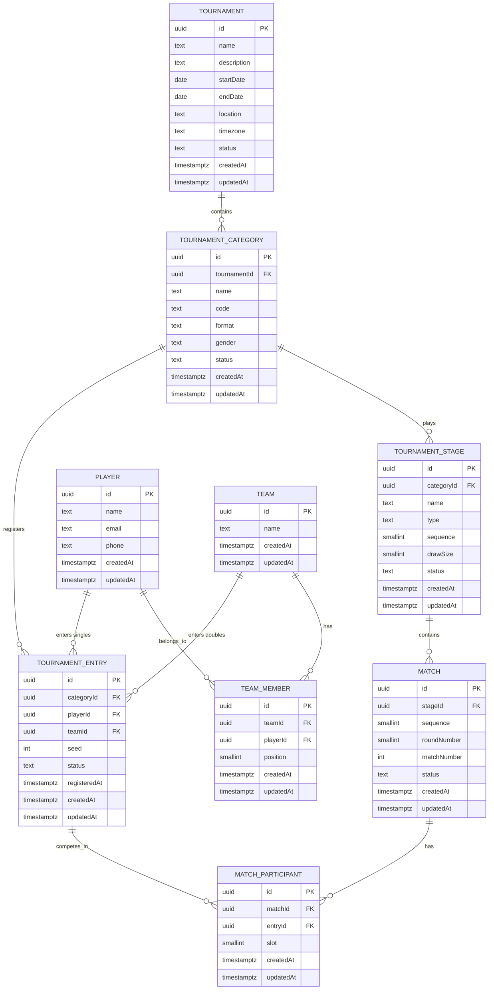

# Phase 2 — Tournament Domain & Database Design

> **Status:** finalized design specification. No schema, migration, API, service,
> repository or UI change accompanies this document. See
> [Phase boundary](#21-phase-boundary-and-deferred-functionality) for what is included
> and deferred. The open questions from the review have been resolved in
> [Resolved design decisions](#22-resolved-design-decisions).

## 1. Scope

Phase 2 designs the tournament domain and its relational database model. It is a
**design-only** phase: the goal is to settle the model now so that tournament setup,
registration, doubles teams, group scheduling, scoring, knockout progression, court
allocation, live dashboards, realtime updates and statistics can be built later
without rewriting tables or migrations.

In scope:

- A normalized, data-driven model for tournaments, categories, players, teams,
  entries, stages, matches and match participants.
- Explicit primary/foreign keys, nullability, uniqueness, indexes and referential
  actions.
- A proposed Prisma schema (shown for reference, **not applied**).
- A clear split between **database-enforced** constraints (keys, uniqueness, simple
  `CHECK`s) and **service/domain-enforced** rules (cross-table business rules).
- Domain invariants, lifecycle/mutability rules, API and validation boundaries,
  repository/service architecture, a test strategy and a list of deferred features.
- Resolution of the review's open questions, recorded in
  [Resolved design decisions](#22-resolved-design-decisions).

Out of scope: any implementation. The Phase 1 model `SystemMetadata` is unchanged, no
new dependency is introduced and no package version is touched.

## 2. Domain overview

A **tournament** is an event held at a place over a date range. It contains one or
more **categories** (e.g. "Men's Singles", "Mixed Doubles"). A category is a
_competition_: something a competitor can enter and win. Who competes depends on the
category **format** — an individual **player** for singles, a **team** for doubles.

The concept that unifies both is the **tournament entry**: the registration of one
competitor into one category. A category is played through one or more **stages**
(a group stage, then a knockout). Each stage contains **matches**, and each match has
**participants**, where a participant is a tournament entry. Nothing in the match layer
knows whether an entry is backed by a player or a team, so the same match abstraction
serves singles and doubles.

Key modelling decisions, stated once and repeated in
[Architectural decisions](#20-architectural-decisions):

- The **competitor** abstraction is `TournamentEntry`, not `Player` and not `Team`.
- Matches reference entries, never players or teams directly.
- Category format is **data**, not hard-coded columns or one enum arm per category.
- Teams are **reusable rosters** shared across tournaments; participation is expressed
  only through entries, never by duplicating players.
- **Player profiles** are intentionally thin; ranking, stats, photos, auth and payments
  are later concerns.

## 3. Conceptual model

Non-technical view:

```text
Tournament
  |
  +-- Category  (Men's Singles, Women's Doubles, Mixed Doubles, ...)
  |     |
  |     +-- Entry ------ Player                      (singles: one player)
  |     |
  |     +-- Entry ------ Team ------ Player A         (doubles: one team of two players)
  |     |                       \---- Player B
  |     |
  |     +-- Stage (Group) --- Match --- two participants, both Entries
  |     +-- Stage (Knockout) - Match --- two participants, both Entries
  |
  +-- ... more categories
```

The unifying idea: **singles entry = player, doubles entry = team, match participant =
entry.** Every match, of any format, is two entries facing each other.

## 4. Entity definitions

Conventions used throughout:

- `id` — surrogate primary key, UUID (see [§7 IDs](#7-identifier-strategy)).
- `createdAt` / `updatedAt` — `timestamptz`, UTC (see [§8 Timestamps](#8-timestamps)).
- `status` — stored as a string column constrained by a database `CHECK`/native enum;
  see each entity.
- Table names are `snake_case`, plural (`tournaments`, `tournament_categories`, ...).

### 4.1 Tournament

**Purpose.** A single tournament/event, the aggregate root of the domain.

| Field         | Type        | Null | Notes                                   |
| ------------- | ----------- | ---- | --------------------------------------- |
| `id`          | uuid        | no   | PK                                      |
| `name`        | text        | no   | 1–200 chars, trimmed; uniqueness below  |
| `description` | text        | yes  | Free text                               |
| `startDate`   | date        | no   | Calendar date, no time component        |
| `endDate`     | date        | no   | `endDate >= startDate` (CHECK)          |
| `location`    | text        | yes  | Venue/place, free text at this phase    |
| `timezone`    | text        | no   | IANA timezone name, e.g. `Asia/Kolkata` |
| `status`      | text        | no   | Lifecycle enum, default `DRAFT`         |
| `createdAt`   | timestamptz | no   | `now()`                                 |
| `updatedAt`   | timestamptz | no   | `@updatedAt`                            |

**Primary key.** `id`.
**Foreign keys.** None. Tournament is the root.
**Unique constraints.** A partial unique index on `lower(name)` **only for non-terminal
statuses** (`DRAFT`, `REGISTRATION_OPEN`, `REGISTRATION_CLOSED`, `IN_PROGRESS`), so the
same name cannot be reused while an event is live, but a `COMPLETED`/`CANCELLED` event
can later be repeated with the same name (an annual tournament). Plain `@@unique([name])`
is rejected because "Summer Open" recurs every year.
**Indexes.** `status` (list/filter active events), `startDate` (ordering/calendar).
**Relationships.** 1—N `TournamentCategory`.
**Lifecycle.** `DRAFT → REGISTRATION_OPEN → REGISTRATION_CLOSED → IN_PROGRESS →
COMPLETED`, with `CANCELLED` reachable from any non-terminal state. See
[§13 Lifecycle rules](#13-lifecycle-and-mutability-rules).
**Invariants.** `endDate >= startDate`; name non-empty; `timezone` is a valid IANA name;
status within the allowed set.
**Timezone.** `timezone` is a **required** IANA timezone name (`Asia/Kolkata`, not `IST`,
`PST` or `GMT`, which are ambiguous). It records the tournament's _local_ timezone and is
distinct from the record timestamps, which are always UTC (see §8). Whether it carries a
project-wide default (e.g. `Asia/Kolkata` for an India-first product) or is required from
the organiser is a product decision recorded in [§23](#23-open-questions); the column
itself is `NOT NULL` either way. No scheduling behaviour is implemented here.
**Extensibility.** Contact/organiser, entry fees and per-tournament defaults are additive
nullable columns. Do **not** add category-specific fields here.

### 4.2 Tournament Category

**Purpose.** A competition within a tournament. The unit that players register _into_.

| Field          | Type        | Null | Notes                                                       |
| -------------- | ----------- | ---- | ----------------------------------------------------------- |
| `id`           | uuid        | no   | PK                                                          |
| `tournamentId` | uuid        | no   | FK → `tournaments.id`, `ON DELETE RESTRICT`                 |
| `name`         | text        | no   | Display name, e.g. "Men's Doubles"                          |
| `code`         | text        | no   | Organiser-entered short code, e.g. `MS`, `WD`, `XD`         |
| `format`       | text        | no   | `SINGLES` \| `DOUBLES` (see below)                          |
| `gender`       | text        | yes  | `MALE` \| `FEMALE` \| `MIXED` \| `OPEN`, nullable           |
| `status`       | text        | no   | `DRAFT` \| `OPEN` \| `CLOSED` \| `COMPLETED` \| `CANCELLED` |
| `createdAt`    | timestamptz | no   | `now()`                                                     |
| `updatedAt`    | timestamptz | no   | `@updatedAt`                                                |

**Primary key.** `id`.
**Foreign keys.** `tournamentId`.
**Unique constraints.** `UNIQUE (tournamentId, code)` on the **normalized** code (see
below), and a unique index on `(tournamentId, lower(name))` (no two categories with the
same display name inside one tournament). Across tournaments both code and name repeat
freely: `MS` in tournament A and `MS` in tournament B are both valid.
**Indexes.** `tournamentId` (fetch a tournament's categories).
**Relationships.** N—1 `Tournament`; 1—N `TournamentEntry`; 1—N `TournamentStage`.
**Lifecycle.** `DRAFT` while being configured; `OPEN` while accepting entries; `CLOSED`
once entries are locked; `COMPLETED`/`CANCELLED` terminal.
**Code.** `code` is **entered by the organiser**, not derived from `name` — an organiser
may want `MS` for "Men's Singles" or a different local convention, and a machine-readable
code should not depend on a display string that can be renamed. Requirements: unique
within a tournament, **not** globally unique, and suitable as an API reference. To keep
comparisons consistent, the code is **normalized in the application/domain layer** to
uppercase, trimmed, with internal whitespace collapsed or rejected, and constrained to
`^[A-Z0-9-]{1,8}$`; the `UNIQUE (tournamentId, code)` constraint then operates on the
already-normalized value. The normalization belongs in the domain layer (and is mirrored
by a Zod rule at the API boundary), not in a database expression index, so that
`TournamentCategory.code` is always stored canonically.
**Gender.** `gender` is a nullable classification of the category's field, with values
`MALE`, `FEMALE`, `MIXED` and `OPEN`. `OPEN` is a first-class, explicit value: a category
may deliberately be open to any gender. `gender` is **not** a universal required field —
an optional, explicit classification keeps the model flexible for future categories
(e.g. "Veterans", "U17") without a migration. It is deliberately **not** mandatory,
because gender is a property of particular category conventions, not of the domain. Note
that `gender` is orthogonal to `format`: "Men's Singles" is `SINGLES`/`MALE`, "Mixed
Doubles" is `DOUBLES`/`MIXED`, and "Open Doubles" is `DOUBLES`/`OPEN`.
**Gender rules for mixed categories.** The rule "a `MIXED` doubles team must contain at
least one player of each gender" depends on player gender, which the Player model does not
store at this phase. It is **not** implemented now and must **not** be encoded as a
complicated database constraint. When player gender is introduced, this becomes a
**category/domain validation rule** in the registration service. Documented, not
implemented.
**Invariants.** `code` is non-empty after normalization and matches the normalized
pattern; a category cannot be deleted once entries exist (see
[§14 Referential actions](#14-referential-actions)).
**Format representation.** `format` is a small closed set of _behavioural_ kinds —
`SINGLES` and `DOUBLES` change how entries are validated, how teams behave and how many
players a side has. It is therefore a genuine enum. **Category identity** ("Men's
Singles", "Mixed Doubles") is intentionally **not** an enum: it is data, so new
categories never require a migration. This is the central anti-hard-coding rule.
**Extensibility.** Age group, skill level, draw size, seeding policy and match format
(best-of-3) become nullable columns later. A future `TEAM` (3+ players) format value is
possible; the enum can be extended, or the column relaxed to text with a CHECK.

### 4.3 Player

**Purpose.** A real person who participates. Deliberately thin.

| Field       | Type        | Null | Notes                      |
| ----------- | ----------- | ---- | -------------------------- |
| `id`        | uuid        | no   | PK                         |
| `name`      | text        | no   | Display name, 1–200 chars  |
| `email`     | text        | yes  | Optional; uniqueness below |
| `phone`     | text        | yes  | Optional; uniqueness below |
| `createdAt` | timestamptz | no   | `now()`                    |
| `updatedAt` | timestamptz | no   | `@updatedAt`               |

**Primary key.** `id`.
**Foreign keys.** None.
**Unique constraints.** Both `email` and `phone` are **nullable and uniquely indexed
only when non-null** (`WHERE email IS NOT NULL`, `WHERE phone IS NOT NULL`), and compared
case-insensitively for email. Null is _not_ considered a duplicate, which is exactly the
SQL semantics of a partial unique index and the reason it is used instead of Prisma's
`@unique` (which would be a plain unique index and still allows multiple NULLs in
Postgres — acceptable, but partial is explicit and documents intent).
**Indexes.** `name` for admin search; the two partial unique indexes above.
**Relationships.** 1—N `TournamentEntry` (as the singles competitor); 1—N `TeamMember`.
**Lifecycle.** Created on first registration; effectively immutable except contact
details.
**Invariants.** `name` non-empty; email/phone optional but unique when present; a player
is never deleted while referenced by an entry or team membership (`RESTRICT`).
**Explicitly deferred.** Rankings, ratings, statistics, photos, payment info,
authentication, addresses, date of birth, nationality, handedness.
**Extensibility.** A nullable `userId` FK to an auth table later links a player to a
login without changing existing rows.

### 4.4 Team

**Purpose.** A doubles pairing/competitor, without duplicating player data.

| Field       | Type        | Null | Notes                            |
| ----------- | ----------- | ---- | -------------------------------- |
| `id`        | uuid        | no   | PK                               |
| `name`      | text        | no   | Display label, e.g. "Ng / Smith" |
| `createdAt` | timestamptz | no   | `now()`                          |
| `updatedAt` | timestamptz | no   | `@updatedAt`                     |

**Primary key.** `id`.
**Foreign keys.** None directly (members live in `TeamMember`).
**Unique constraints.** None on `name` — team names are not assumed globally unique.
**Indexes.** `name` optional for search.
**Relationships.** 1—N `TeamMember`; 1—N `TournamentEntry`.
**Lifecycle.** Created with its members; membership is mutable until the team has a
`CONFIRMED`/locked entry; immutable once the category is `IN_PROGRESS`.
**Reusable vs tournament-specific vs category-specific — decision: globally
reusable**, i.e. a team is an independent roster. Reasoning:

- The same two people commonly re-pair across categories (Men's Doubles _and_ a
  knockout side-event) and across tournaments. Forcing a new team row per
  tournament/category duplicates membership and invites drift ("Player B changed
  spelling in one row").
- Reuse keeps `Team` a pure roster. Tournament- and category-specific attributes
  (seed, group, penalty) belong to the **entry**, which already scopes to a category.
- Nullable `tournamentId`/`categoryId` on `Team` would be the worst of both: mostly
  NULL columns and an invariant "these two must be set together", which is exactly the
  polymorphic smell we are avoiding in `TournamentEntry`.

Alternatives considered: tournament-scoped teams (simpler uniqueness, but duplicated
rosters) and category-scoped teams (matches how a draw sees a pair, but multiplies rows
and complicates reuse). Global roster wins on normalization.

**Reuse across tournaments.** A team is not owned by a tournament. The **same** team can
compete in many tournaments (and in many categories) through separate `TournamentEntry`
records. There is deliberately **no** global uniqueness constraint on the _pair of
players_: Tournament A with (Player A + Player B) and Tournament B with the same pair are
both valid, whether or not they reuse the identical `Team` row.

**No tournament-scoped player copies.** Participation is expressed only by
`TournamentEntry`; there is no `TournamentPlayer` (or equivalent per-tournament player)
entity, and `Player` rows are never duplicated per tournament.

**Invariants.** A team has 1..N members at the data level; the _format_ invariant
(exactly 2 for `DOUBLES`) is enforced in the domain/service layer per
[§12 Domain invariants](#12-domain-invariants). A player appears at most once per team
(`UNIQUE (teamId, playerId)`).

**Extensibility.** A `TeamMember.role` or captain flag, or a nullable `homeClubId`, can be
added later.

### 4.5 Team Member

**Purpose.** Join table between `Team` and `Player`; models the roster.

| Field       | Type        | Null | Notes                                         |
| ----------- | ----------- | ---- | --------------------------------------------- |
| `id`        | uuid        | no   | PK (see note)                                 |
| `teamId`    | uuid        | no   | FK → `teams.id`, `ON DELETE CASCADE`          |
| `playerId`  | uuid        | no   | FK → `players.id`, `ON DELETE RESTRICT`       |
| `position`  | smallint    | no   | 1-based slot/order within the team; default 1 |
| `createdAt` | timestamptz | no   | `now()`                                       |
| `updatedAt` | timestamptz | no   | `@updatedAt`                                  |

**Primary key.** Surrogate `id` **plus** a business composite unique
`UNIQUE (teamId, playerId)`.
**Why a surrogate PK rather than composite PK `(teamId, playerId)`.** A composite PK is
workable, but a surrogate keeps the row addressable and mutation-friendly (change a
player in one slot) and matches the UUID convention used everywhere else; consistency
was chosen over saving four bytes.
**Order/position.** Yes, an explicit `position` is required. Line-up order matters for
presentation ("Player 1 / Player 2") and for deterministic seeding/team-display later.
Alternative considered: order by `createdAt` — rejected because reordering means
delete-and-recreate, and timestamps can tie.
**Unique constraints.** `UNIQUE (teamId, playerId)` prevents the same player twice in a
team. A partial unique index `UNIQUE (teamId, position)` is **not** added now, because
enforcing exact positions is a domain rule tied to format; documented as a future
constraint.
**Indexes.** `teamId`; `playerId` (answer "which teams is this player on").
**Relationships.** N—1 `Team`; N—1 `Player`.
**Invariants.** No duplicate `(teamId, playerId)` (database-enforced). Each team must have
at least one member, and a doubles team exactly two — both are **service/domain**
invariants enforced transactionally when a team is created and when an entry is
confirmed, backed by automated tests rather than by a PostgreSQL trigger (see
[§10.5](#105-service-enforced-rules-not-database-triggers)). A player appears at most
once per team.

**Explicit note.** The same player **may** belong to many teams across categories and
tournaments. We deliberately do **not** put a unique constraint on `playerId` alone.

### 4.6 Tournament Entry (Registration)

**Purpose.** The competitor registered into one category. The keystone entity.

| Field          | Type        | Null | Notes                                                         |
| -------------- | ----------- | ---- | ------------------------------------------------------------- |
| `id`           | uuid        | no   | PK                                                            |
| `categoryId`   | uuid        | no   | FK → `tournament_categories.id`, `ON DELETE RESTRICT`         |
| `playerId`     | uuid        | yes  | FK → `players.id`, `ON DELETE RESTRICT`; set for singles only |
| `teamId`       | uuid        | yes  | FK → `teams.id`, `ON DELETE RESTRICT`; set for doubles only   |
| `seed`         | integer     | yes  | Optional draw seed; positive when present; never required     |
| `status`       | text        | no   | `PENDING` \| `CONFIRMED` \| `WITHDRAWN` \| `DISQUALIFIED`     |
| `registeredAt` | timestamptz | no   | `now()`                                                       |
| `createdAt`    | timestamptz | no   | `now()`                                                       |
| `updatedAt`    | timestamptz | no   | `@updatedAt`                                                  |

**Primary key.** `id`.
**Foreign keys.** `categoryId`, `playerId` (nullable), `teamId` (nullable).
**The "exactly one competitor" design.** `playerId` and `teamId` are both nullable, with
the invariant **exactly one is non-null**. This is chosen over the alternatives
(document them in §20) for these reasons:

1. Both FKs are _real_ foreign keys to _real_ tables, so referential integrity is
   enforced by Postgres. A polymorphic `(competitorType, competitorId)` column pair
   cannot have a single FK and would silently allow dangling ids.
2. The match layer queries entries uniformly — no joins on a type discriminator.
3. Adding a third competitor kind later (a "pair" or "club") is additive: one more
   nullable FK plus one more arm of the CHECK.

**Ownership is stated as a two-part rule**, and the two parts are enforced in different
places:

| Part                                                 | Enforced by        | Mechanism                                                                    |
| ---------------------------------------------------- | ------------------ | ---------------------------------------------------------------------------- |
| Exactly one of `playerId` / `teamId` is set          | **Database**       | `CHECK ((player_id IS NOT NULL)::int + (team_id IS NOT NULL)::int = 1)`      |
| The set owner's kind matches the category's `format` | **Domain/service** | `SINGLES` ⇒ `playerId` required, `teamId` forbidden; `DOUBLES` ⇒ the reverse |

Concretely, the format rule is:

```text
TournamentCategory.format = SINGLES
    -> entry.playerId required
    -> entry.teamId forbidden
TournamentCategory.format = DOUBLES
    -> entry.teamId required
    -> entry.playerId forbidden
```

The database enforces only the **structural** half (exactly one owner), because that is a
row-local `CHECK` with no cross-table read. The **format half is a cross-table rule** and
belongs to the registration service, which loads the category, checks `format` against the
supplied competitor, and rejects a mismatch with a typed error inside the same transaction
that writes the entry. We deliberately **do not** implement the format rule as a
PostgreSQL trigger: it would duplicate logic the service must own anyway (it needs a
friendly error before the write), add a maintenance burden on every write path, and make
the rule harder to test. The trade-off — and the residual risk that a non-service writer
could bypass the format check — is recorded in [§23](#23-open-questions). Prisma
validation alone is explicitly **not** relied upon.
**Unique constraints.**

- Singles: `UNIQUE (categoryId, playerId) WHERE playerId IS NOT NULL` — a player
  enters a category once.
- Doubles: `UNIQUE (categoryId, teamId) WHERE teamId IS NOT NULL` — a team enters a
  category once.
  Two partial unique indexes rather than one composite, because a composite over two
  nullable columns would not do what is intended (NULLs compare distinct).

**Player may not be in two teams in the same category (resolved).** A player must not
belong to more than one active team within the same tournament category:

```text
Men's Doubles
  Player A + Player B  ->  valid
  Player A + Player C  ->  invalid
```

This is a **domain/service invariant**, not a simple database unique constraint, because
the rule traverses `Player -> TeamMember -> Team -> TournamentEntry -> TournamentCategory`.
The registration service enforces it transactionally when a doubles entry is created or a
team's membership changes, in the same transaction as the write. The database remains
responsible for structural integrity (FKs, partial uniques, CHECKs); it is not asked to
express this join-heavy rule. See [§12](#12-domain-invariants) and
[§22](#22-resolved-design-decisions).
**Indexes.** `categoryId` (list a draw's entries); the partial unique indexes above also
serve `playerId` / `teamId` lookups, and an additional plain index on `teamId` supports
"all entries for this team" clearly.
**Relationships.** N—1 `TournamentCategory`, N—1 `Player` (nullable), N—1 `Team`
(nullable); 1—N `MatchParticipant`.
**Seed.** `seed` is **optional and nullable** and must **not** be required when an entry is
created. Seeds are assigned by the organiser or the draw-generation algorithm during
competition setup, which is a **later phase**; the column exists now only so the draw
phase can populate it without a migration. When present it must be positive
(`CHECK (seed IS NULL OR seed > 0)`).
**Lifecycle.** `PENDING` (submitted, not yet accepted) → `CONFIRMED` (accepted, may be
seeded/placed) → optionally `WITHDRAWN` (pulled before/at start) or `DISQUALIFIED`
(removed by organiser). See §13 for which states are reachable when.
**Are all four statuses needed now?** Review of alternatives: a boolean `confirmed`
cannot express withdrawal/disqualification and cannot carry the audit meaning; adding a
fifth state (`WAITLIST`) is speculative. The four chosen states are the minimum that
(a) supports the registration flow the product needs, (b) lets an entry exist after
leaving the draw so match history stays intact, and (c) is a closed set that can grow
additively. Keep them.
**Invariants.** Exactly one competitor (`CHECK`, database); competitor kind matches
category format (service); no duplicate registration per category (partial uniques,
database); a player is not in two teams of the same category (service); `seed > 0` when set
(database); an entry may not be deleted once it has match participants (`RESTRICT` via
`MatchParticipant`).
**Extensibility.** `notes`, `registeredByUserId`, `partnerRequest`, withdrawal reason
and timestamps are additive.

### 4.7 Tournament Stage

**Purpose.** A competitive phase inside a category (group stage, then knockout rounds).

| Field        | Type        | Null | Notes                                                 |
| ------------ | ----------- | ---- | ----------------------------------------------------- |
| `id`         | uuid        | no   | PK                                                    |
| `categoryId` | uuid        | no   | FK → `tournament_categories.id`, `ON DELETE RESTRICT` |
| `name`       | text        | no   | e.g. "Group Stage", "Semi Final"                      |
| `type`       | text        | no   | `GROUP` \| `KNOCKOUT`                                 |
| `sequence`   | smallint    | no   | 1-based order within the category                     |
| `drawSize`   | smallint    | yes  | Optional planned size (groups: 4, knockout: 8)        |
| `status`     | text        | no   | `PENDING` \| `ACTIVE` \| `COMPLETED`                  |
| `createdAt`  | timestamptz | no   | `now()`                                               |
| `updatedAt`  | timestamptz | no   | `@updatedAt`                                          |

**Primary key.** `id`.
**Foreign keys.** `categoryId`.
**Unique constraints.** `UNIQUE (categoryId, sequence)` — deterministic ordering and no
two stages occupying the same slot. `UNIQUE (categoryId, name)` if names are expected
unique within a category (recommended).
**Indexes.** `categoryId`.
**Relationships.** N—1 `TournamentCategory`; 1—N `Match`.
**Lifecycle.** `PENDING` → `ACTIVE` → `COMPLETED`.
**Stage types — is `GROUP`/`KNOCKOUT` enough now?** Yes for this phase. The type
determines what a future generator does and, later, how standings versus brackets are
derived. A third type is foreseeable but not needed: a knockout "round" (e.g. Semi
Final) is a _stage_ with its own sequence and matches, not a new type. If a
consolation/placement playoff appears, it is still `KNOCKOUT`. A future
`ROUND_ROBIN_LEAGUE` (no groups, one table) would be a new value; the enum can be
extended without touching existing rows. Prefer an enum for the same reason as category
format: a closed set of _behavioural_ kinds.
**Ordering.** Explicit `sequence` rather than relying on `createdAt`, so reordering a
stage (insert a group stage before a knockout) is a data edit and stays deterministic.
**Extensibility.** `groupCount`, `advancePerGroup`, bracket metadata and per-stage match
format belong to a later phase or a nullable config column.

### 4.8 Match

**Purpose.** Foundation record of a fixture within a stage. No scoring or algorithms.

| Field         | Type        | Null | Notes                                                      |
| ------------- | ----------- | ---- | ---------------------------------------------------------- |
| `id`          | uuid        | no   | PK                                                         |
| `stageId`     | uuid        | no   | FK → `tournament_stages.id`, `ON DELETE RESTRICT`          |
| `sequence`    | smallint    | no   | 1-based order within the stage                             |
| `roundNumber` | smallint    | yes  | Knockout round index; null for groups                      |
| `matchNumber` | integer     | yes  | Human-facing/unstable label; nullable                      |
| `status`      | text        | no   | `SCHEDULED` \| `IN_PROGRESS` \| `COMPLETED` \| `CANCELLED` |
| `createdAt`   | timestamptz | no   | `now()`                                                    |
| `updatedAt`   | timestamptz | no   | `@updatedAt`                                               |

**Primary key.** `id`.
**Foreign keys.** `stageId` only.
**Unique constraints.** `UNIQUE (stageId, sequence)` — deterministic match order and no
slot collisions.
**Do we need `roundNumber` and `matchNumber`?**

- `roundNumber` — yes. Knockout stages need a round index (Round of 16, QF, SF, F)
  independent of `sequence`, so the same stage can span several rounds and future
  progression logic can group by round. Nullable because a group stage has no rounds.
- `matchNumber` — nullable and _not_ load-bearing. Useful as a display label but not
  required; kept nullable so a generator can fill it later without blocking inserts.
- `status` — yes. The dashboard, court and live screens need to know whether a match is
  scheduled, live, finished or cancelled. The set is deliberately small; result variants
  (walkover/retirement/disqualification) belong to the future match-result model, not here
  (see below and [§19](#19-future-compatibility)).
- Deliberately **absent**: scores, sets, points, winner, court, scheduled time, live
  state. Those arrive in later phases and are additive.
  **Indexes.** `stageId` (all matches of a stage); `status` (court/live dashboards).
  **Relationships.** N—1 `TournamentStage`; 1..2 `MatchParticipant` (normally exactly 2).
  **Lifecycle.** `SCHEDULED -> IN_PROGRESS -> COMPLETED`, with `CANCELLED` as a terminal
  alternative. Lifecycle is _recorded_ now, but transitions are not enforced until scoring
  exists.
  **Invariants.** Belongs to exactly one stage; `(stageId, sequence)` unique; a completed
  match cannot lose its participants.
  **Walkover / retirement / disqualification (deferred).** Phase 2 does **not** model how
  a match ends beyond a coarse `status`. A future match-result model must distinguish
  `NORMAL`, `WALKOVER`, `RETIREMENT` and `DISQUALIFICATION` (or an equivalent design).
  Nothing here prevents that: the current `Match`/`MatchParticipant`/`TournamentEntry`
  shape supports normal completion, walkovers, retirements and disqualifications once the
  result model is added. See [Resolved design decisions](#22-resolved-design-decisions).
  **Extensibility.** A match-result model (`Game`/`GameScore` and an outcome kind), court
  and venue entities, scheduling fields (`scheduledAt`, `courtId`) and knockout source
  references (`winnerOfMatchId`, `loserOfMatchId`, `sourceGroupId`, `sourcePosition`) are
  planned additions, not part of this phase. They are additive columns/tables and require
  no change to the current keys.

### 4.9 Match Participant

**Purpose.** The competitors in a match: two entries facing each other.

| Field       | Type        | Null | Notes                                               |
| ----------- | ----------- | ---- | --------------------------------------------------- |
| `id`        | uuid        | no   | PK                                                  |
| `matchId`   | uuid        | no   | FK → `matches.id`, `ON DELETE CASCADE`              |
| `entryId`   | uuid        | no   | FK → `tournament_entries.id`, `ON DELETE RESTRICT`  |
| `slot`      | smallint    | no   | 1 = side A, 2 = side B (not a text enum; see below) |
| `createdAt` | timestamptz | no   | `now()`                                             |
| `updatedAt` | timestamptz | no   | `@updatedAt`                                        |

**Primary key.** `id`.
**Foreign keys.** `matchId`, `entryId`.
**Relationships.** N—1 `Match`; N—1 `TournamentEntry`. **Never** Player or Team — that
is the rule that keeps the match layer format-agnostic.
**Slot representation.** `smallint` constrained by `CHECK (slot IN (1, 2))`, chosen over
a text `'A'/'B'` enum: it sorts naturally, matches "side 1/side 2" in future score rows,
and is cheap. `A`/`B` remain the display labels.
**Unique constraints.**

- `UNIQUE (matchId, slot)` — one entry per side; prevents the same entry occupying
  both sides (invariant 11).
- `UNIQUE (matchId, entryId)` — the same entry cannot appear twice in a match, even in
  different slots.
  **Indexes.** The unique constraints index `(matchId, slot)` and `(matchId, entryId)`;
  both already serve lookups by `matchId` and by `entryId`, so no extra plain index is
  needed.
  **Invariants.** References exactly one entry; no duplicate entry per match; slot in
  {1,2}; normally exactly two participants per non-cancelled match (a domain/service rule;
  the future result model decides how a walkover is represented — see §19).
  **Extensibility.** Per-side score summary, an outcome/result kind, or a `winnerEntryId`
  on `Match` (rather than here) are later additions.

## 5. Relationships

```text
Tournament          1 ──── N TournamentCategory
TournamentCategory  1 ──── N TournamentEntry
TournamentCategory  1 ──── N TournamentStage
Player              1 ──── N TournamentEntry        (nullable side: singles)
Team                1 ──── N TournamentEntry        (nullable side: doubles)
Team                1 ──── N TeamMember
Player              1 ──── N TeamMember
TournamentStage     1 ──── N Match
Match               1 ──── N MatchParticipant
TournamentEntry     1 ──── N MatchParticipant
```

Are these sufficient? Yes for the phase-2 foundations. Notes:

- An entry reaches exactly one category, and through it one tournament. There is no
  direct `entry.tournamentId`; adding one would denormalize and risk disagreement with
  the category's tournament.
- A match reaches its category/tournament through `stage.category.tournament`.
- `MatchParticipant` carries the 1..2 cardinality. A `Match` with one participant is
  only meaningful for a walkover/bye, which the future result model will formalise; it is
  a status/result concern, not a relationship concern.
- Future join tables that do **not** change this skeleton: group membership
  (`StageGroup` + `GroupEntry`), knockout source references, `Court`/`Venue`,
  `Game`/`GameScore`.

## 6. ER diagram

Full ER diagram (Mermaid). Primary keys are marked `PK`, foreign keys `FK`.



The simplified conceptual diagram for non-technical review is in
[§3 Conceptual model](#3-conceptual-model).

## 7. Identifier strategy

**Decision: PostgreSQL native `uuid` columns for every Phase 2 domain entity, generated by
the database, written as `id String @id @default(uuid()) @db.Uuid` in Prisma.**

The `String` TypeScript type keeps ids ergonomic in the application, while `@db.Uuid`
makes PostgreSQL store them natively (16 bytes) with a real `uuid` column. This is the
preferred representation and is used consistently for all new domain entities.

**Phase 1 is not changed.** `SystemMetadata` keeps its current `String @id @default(uuid())`
definition (a `text` column). It is infrastructure bookkeeping, not a domain entity, and is
deliberately left untouched — Phase 1 remains exactly as merged. New Phase 2 entities adopt
`@db.Uuid`; the two coexist without difficulty because they are separate tables.

Reasoning:

- **Native storage.** A `uuid` column is smaller than `text` and typed, so the database
  rejects malformed values.
- **Consistency across the new domain.** All Phase 2 entities use one representation;
  there is a single documented reason (legacy Phase 1 table) for the one exception.
- **Client-generatable.** UUIDs let an offline or optimistic client create a row id
  before the server assigns it, which matters for realtime/Supabase later.
- **Non-enumerable.** API paths never expose sequential counts.
- **Merge-friendly.** No sequence coordination is needed if data is ever imported or
  merged across environments, which matters for the Supabase production plan.

Details:

- **Generation.** Database-generated default (`gen_random_uuid()`, available with no
  extension on PostgreSQL 13+; `pgcrypto` otherwise). Application code may also generate
  a UUID when it needs the id before insert; the default is the backstop.
- **Application expectation.** Ids are `string` in TypeScript, opaque, never parsed or
  treated as numbers. `packages/domain` types use `readonly id: string`.
- **API exposure.** Ids are returned as-is in resources and used as path params,
  validated with `z.uuid()` (Zod 4) before use.
- **Indexing.** Primary-key indexes are B-tree on the `uuid` column. Random v4 ids make
  inserts non-sequential; for a tournament workload (hundreds to a few hundred thousand
  rows) this is irrelevant. If insert locality ever matters, switching _generation_ to
  UUIDv7 is possible without changing the column type or API — noted as a future option.
- **Not chosen:** auto-increment integers (enumerable, awkward for client-generated ids,
  merge-hostile), cuid2 (adds a dependency for no Phase-2 benefit), ULID (no advantage
  over native UUID here).

## 8. Timestamps

**Decision:** every entity carries `createdAt` and `updatedAt`, both
`timestamp with time zone` (`timestamptz`), stored in **UTC**, defaulted to `now()` and
maintained by Prisma `@updatedAt`.

- **Timezone expectation.** `timestamptz` stores an absolute instant and displays in the
  session timezone; it is never ambiguous the way `timestamp without time zone` is.
  Servers, CI and Supabase all run in UTC. API responses serialise as ISO-8601 UTC
  (`2026-09-27T07:00:00.000Z`); the browser formats to local time for display.
- **Three distinct time concepts**, deliberately separated:
  1. **Calendar date** — `Tournament.startDate` / `endDate` are `date`, not timestamps.
     A tournament that "runs 3–5 October" has no time-of-day; storing it as a timestamp
     would invent a midnight and invite timezone bugs. `date` is the correct type.
  2. **Tournament-local timezone** — `Tournament.timezone` is a **required** IANA name
     (e.g. `Asia/Kolkata`), not an abbreviation such as `IST`/`PST`/`GMT`, which are
     ambiguous. It is the reference zone for interpreting the calendar dates and, later,
     any "local" match times. It is _not_ a timestamp.
  3. **Record timestamps** — `createdAt`/`updatedAt` are `timestamptz` in UTC,
     bookkeeping only.
- **Timestamps stay UTC.** All `timestamptz` values (`createdAt`, `updatedAt`, and future
  scheduled instants) are absolute moments stored in UTC using PostgreSQL timestamp
  semantics. The tournament `timezone` only affects how local calendar dates and future
  local times are interpreted and displayed; it never changes how instants are stored.
- **No scheduling yet.** Phase 2 defines no scheduled-time column on `Match`; when
  scheduling arrives it will be a `timestamptz` interpreted against `Tournament.timezone`.
  Documented, not implemented.
- **`updatedAt` maintenance.** Kept at the application layer initially (Prisma
  `@updatedAt`) to match Phase 1; a database trigger is an option if writes ever bypass
  the repository. Not required now.

## 9. Proposed Prisma schema (reference only — NOT applied)

> This is the design proposal (the specification for the next phase). `prisma/schema.prisma`
> is **not** modified in this phase. `SystemMetadata` stays exactly as it is (a `text` id)
> and would remain in the same file. The domain entities below use `String @id @default(uuid()) @db.Uuid`
> for native PostgreSQL UUID storage while staying ergonomic in TypeScript. Prisma cannot
> express a few constraints (simple `CHECK`s and partial unique indexes); those are listed
> after the block and will be added as hand-written SQL in the migration. Cross-table
> business rules are **not** expressed as triggers; they belong to the service layer
> (see [§10.5](#105-service-enforced-rules-not-database-triggers)).

```prisma
// ---------------------------------------------------------------------------
// Phase 2 tournament domain (PROPOSAL - not applied in this phase)
// ---------------------------------------------------------------------------

enum TournamentStatus {
  DRAFT
  REGISTRATION_OPEN
  REGISTRATION_CLOSED
  IN_PROGRESS
  COMPLETED
  CANCELLED
}

enum CategoryFormat {
  SINGLES
  DOUBLES
}

enum CategoryGender {
  MALE
  FEMALE
  MIXED
  OPEN
}

enum CategoryStatus {
  DRAFT
  OPEN
  CLOSED
  COMPLETED
  CANCELLED
}

enum EntryStatus {
  PENDING
  CONFIRMED
  WITHDRAWN
  DISQUALIFIED
}

enum StageType {
  GROUP
  KNOCKOUT
}

enum StageStatus {
  PENDING
  ACTIVE
  COMPLETED
}

enum MatchStatus {
  SCHEDULED
  IN_PROGRESS
  COMPLETED
  CANCELLED
}

model Tournament {
  id          String               @id @default(uuid()) @db.Uuid
  name        String
  description String?
  startDate   DateTime             @db.Date
  endDate     DateTime             @db.Date
  location    String?
  timezone    String
  status      TournamentStatus     @default(DRAFT)
  categories  TournamentCategory[]
  createdAt   DateTime             @default(now())
  updatedAt   DateTime             @updatedAt

  @@index([status])
  @@index([startDate])
  @@map("tournaments")
}

model TournamentCategory {
  id           String             @id @default(uuid()) @db.Uuid
  tournamentId String             @db.Uuid
  tournament   Tournament         @relation(fields: [tournamentId], references: [id], onDelete: Restrict)
  name         String
  code         String
  format       CategoryFormat
  gender       CategoryGender?
  status       CategoryStatus     @default(DRAFT)
  entries      TournamentEntry[]
  stages       TournamentStage[]
  createdAt    DateTime           @default(now())
  updatedAt    DateTime           @updatedAt

  @@unique([tournamentId, code])
  @@map("tournament_categories")
}

model Player {
  id          String            @id @default(uuid()) @db.Uuid
  name        String
  email       String?           @unique
  phone       String?           @unique
  entries     TournamentEntry[]
  teamMembers TeamMember[]
  createdAt   DateTime          @default(now())
  updatedAt   DateTime          @updatedAt

  @@map("players")
}

model Team {
  id        String            @id @default(uuid()) @db.Uuid
  name      String
  members   TeamMember[]
  entries   TournamentEntry[]
  createdAt DateTime          @default(now())
  updatedAt DateTime          @updatedAt

  @@map("teams")
}

model TeamMember {
  id        String   @id @default(uuid()) @db.Uuid
  teamId    String   @db.Uuid
  team      Team     @relation(fields: [teamId], references: [id], onDelete: Cascade)
  playerId  String   @db.Uuid
  player    Player   @relation(fields: [playerId], references: [id], onDelete: Restrict)
  position  Int      @default(1)
  createdAt DateTime @default(now())
  updatedAt DateTime @updatedAt

  @@unique([teamId, playerId])
  @@index([playerId])
  @@map("team_members")
}

model TournamentEntry {
  id           String             @id @default(uuid()) @db.Uuid
  categoryId   String             @db.Uuid
  category     TournamentCategory @relation(fields: [categoryId], references: [id], onDelete: Restrict)
  playerId     String?            @db.Uuid
  player       Player?            @relation(fields: [playerId], references: [id], onDelete: Restrict)
  teamId       String?            @db.Uuid
  team         Team?              @relation(fields: [teamId], references: [id], onDelete: Restrict)
  seed         Int?
  status       EntryStatus        @default(PENDING)
  registeredAt DateTime           @default(now())
  participants MatchParticipant[]
  createdAt    DateTime           @default(now())
  updatedAt    DateTime           @updatedAt

  @@index([categoryId])
  @@index([playerId])
  @@index([teamId])
  @@map("tournament_entries")
}

model TournamentStage {
  id         String             @id @default(uuid()) @db.Uuid
  categoryId String             @db.Uuid
  category   TournamentCategory @relation(fields: [categoryId], references: [id], onDelete: Restrict)
  name       String
  type       StageType
  sequence   Int
  drawSize   Int?
  status     StageStatus        @default(PENDING)
  matches    Match[]
  createdAt  DateTime           @default(now())
  updatedAt  DateTime           @updatedAt

  @@unique([categoryId, sequence])
  @@map("tournament_stages")
}

model Match {
  id           String             @id @default(uuid()) @db.Uuid
  stageId      String             @db.Uuid
  stage        TournamentStage    @relation(fields: [stageId], references: [id], onDelete: Restrict)
  sequence     Int
  roundNumber  Int?
  matchNumber  Int?
  status       MatchStatus        @default(SCHEDULED)
  participants MatchParticipant[]
  createdAt    DateTime           @default(now())
  updatedAt    DateTime           @updatedAt

  @@unique([stageId, sequence])
  @@index([status])
  @@map("matches")
}

model MatchParticipant {
  id        String          @id @default(uuid()) @db.Uuid
  matchId   String          @db.Uuid
  match     Match           @relation(fields: [matchId], references: [id], onDelete: Cascade)
  entryId   String          @db.Uuid
  entry     TournamentEntry @relation(fields: [entryId], references: [id], onDelete: Restrict)
  slot      Int
  createdAt DateTime        @default(now())
  updatedAt DateTime        @updatedAt

  @@unique([matchId, slot])
  @@unique([matchId, entryId])
  @@index([entryId])
  @@map("match_participants")
}
```

**Prisma cannot express**, and therefore needs hand-written SQL in the migration:

- `CHECK (end_date >= start_date)` on `tournaments`.
- `CHECK (seed IS NULL OR seed > 0)` on `tournament_entries`.
- The exactly-one-competitor `CHECK` on `tournament_entries`.
- `CHECK (slot IN (1, 2))` on `match_participants`.
- Partial unique indexes: active tournament name, player email/phone, per-category
  player entry, per-category team entry.
- Relaxing `@unique` on `email`/`phone` to partial unique indexes (Prisma `@unique`
  emits a plain unique index; partial indexes are added by SQL and the Prisma attribute
  removed).

These are all **simple, row-local** constraints. No PostgreSQL trigger is proposed for
Phase 2: cross-table business rules (format compatibility, team size, player-in-two-teams,
mixed-gender rules, lifecycle transitions) are enforced in the domain/service layer. See
[§10.5](#105-service-enforced-rules-not-database-triggers).

`String? @unique` on `email`/`phone` above is shown for readability; the final schema
drops the Prisma `@unique` in favour of the SQL partial unique index, because two NULLs
must not collide and the partial index makes the rule explicit and case-insensitive.

## 10. Constraints

### 10.1 Primary keys

Every table has a single-column `uuid` primary key (see §7).

### 10.2 Foreign keys

| Child                   | Column          | Parent                  | On delete  |
| ----------------------- | --------------- | ----------------------- | ---------- |
| `tournament_categories` | `tournament_id` | `tournaments`           | `RESTRICT` |
| `tournament_entries`    | `category_id`   | `tournament_categories` | `RESTRICT` |
| `tournament_entries`    | `player_id`     | `players`               | `RESTRICT` |
| `tournament_entries`    | `team_id`       | `teams`                 | `RESTRICT` |
| `team_members`          | `team_id`       | `teams`                 | `CASCADE`  |
| `team_members`          | `player_id`     | `players`               | `RESTRICT` |
| `tournament_stages`     | `category_id`   | `tournament_categories` | `RESTRICT` |
| `matches`               | `stage_id`      | `tournament_stages`     | `RESTRICT` |
| `match_participants`    | `match_id`      | `matches`               | `CASCADE`  |
| `match_participants`    | `entry_id`      | `tournament_entries`    | `RESTRICT` |

All FK columns are `NOT NULL` except `tournament_entries.player_id` and
`tournament_entries.team_id`.

### 10.3 Check constraints

```sql
-- tournaments
ALTER TABLE tournaments
  ADD CONSTRAINT tournaments_date_order CHECK (end_date >= start_date),
  ADD CONSTRAINT tournaments_name_present CHECK (length(btrim(name)) > 0);

-- tournament_categories (code is normalized to uppercase before storage)
ALTER TABLE tournament_categories
  ADD CONSTRAINT tournament_categories_code_format CHECK (code ~ '^[A-Z0-9-]{1,8}$');

-- tournament_entries
ALTER TABLE tournament_entries
  ADD CONSTRAINT entries_exactly_one_competitor
    CHECK ((player_id IS NOT NULL)::int + (team_id IS NOT NULL)::int = 1),
  ADD CONSTRAINT entries_seed_positive CHECK (seed IS NULL OR seed > 0);

-- match_participants
ALTER TABLE match_participants
  ADD CONSTRAINT match_participants_slot_valid CHECK (slot IN (1, 2));
```

`Tournament.timezone` is `NOT NULL` but is **not** given a `CHECK`: validating that a
string is a real IANA zone is not a simple row-local predicate (the zone list is not in
the database). It is validated in Zod and the domain layer via the platform's IANA data
(e.g. `Intl.supportedValuesOf('timeZone')`), which is the right layer for an enumerated
external standard.

### 10.4 Partial unique indexes (Prisma cannot emit these)

```sql
-- No two live tournaments share a name; completed/cancelled names are reusable.
CREATE UNIQUE INDEX tournaments_active_name_key
  ON tournaments (lower(name))
  WHERE status IN ('DRAFT', 'REGISTRATION_OPEN', 'REGISTRATION_CLOSED', 'IN_PROGRESS');

-- Category display name unique within a tournament.
CREATE UNIQUE INDEX tournament_categories_name_key
  ON tournament_categories (tournament_id, lower(name));

-- Player contact uniqueness only when present; email case-insensitive.
CREATE UNIQUE INDEX players_email_key
  ON players (lower(email)) WHERE email IS NOT NULL;
CREATE UNIQUE INDEX players_phone_key
  ON players (phone) WHERE phone IS NOT NULL;

-- One singles registration per player per category.
CREATE UNIQUE INDEX entries_category_player_key
  ON tournament_entries (category_id, player_id) WHERE player_id IS NOT NULL;

-- One doubles registration per team per category.
CREATE UNIQUE INDEX entries_category_team_key
  ON tournament_entries (category_id, team_id) WHERE team_id IS NOT NULL;
```

### 10.5 Service-enforced rules (not database triggers)

Phase 2 deliberately keeps database integrity to **simple relational constraints** —
primary keys, foreign keys, `NOT NULL`, `UNIQUE`, partial unique indexes and row-local
`CHECK`s — and leaves **cross-table business rules** to the service layer. No PostgreSQL
trigger or constraint trigger is proposed.

| Rule                                                             | Enforced by    | Where                                                                |
| ---------------------------------------------------------------- | -------------- | -------------------------------------------------------------------- |
| Exactly one of `player_id` / `team_id` is set                    | Database       | `CHECK` on `tournament_entries`                                      |
| Entry owner's kind matches the category `format` (**either/or**) | Domain/service | Registration service loads the category and validates before writing |
| A doubles team has exactly two members                           | Domain/service | team/entry service, transactional                                    |
| A player is not in two teams of the same category                | Domain/service | registration service, transactional                                  |
| `MIXED` category gender composition                              | Domain/service | deferred until player gender exists (see §4.2)                       |
| Lifecycle transitions (e.g. no format change after entries)      | Domain/service | the service owning each aggregate (see §13)                          |
| Tournament `timezone` is a valid IANA name                       | Zod + domain   | API boundary and domain validation                                   |

Why not triggers: each of these rules must **also** exist in the service, because the
service has to produce a typed, user-facing validation error _before_ the write and
inside the same transaction. Implementing them a second time as triggers duplicates logic,
adds a maintenance burden on every write path and migration, and makes the rule harder to
unit-test. The trade-off is explicit: a writer that bypasses the service (a manual SQL
script or a future import job) could violate the format rule, so such writers must apply
the domain rules themselves. The database still guarantees everything structural, which is
the part that must hold "regardless of caller".

**If a rule later proves impossible to enforce safely in the service** — for example a
bulk-import path that cannot reasonably run domain validation — the team may add a
narrowly-scoped constraint trigger as defence in depth, documented with its rationale.
This is a deliberate escape hatch, not the default.

## 11. Index strategy

Indexes follow queries the product will actually issue; nothing is indexed "just in
case". Where a composite unique index already has the needed column as its **leading**
column, no separate single-column index is added — the composite is reused.

| Index                                                                  | Kind           | Serves                                                                              |
| ---------------------------------------------------------------------- | -------------- | ----------------------------------------------------------------------------------- |
| `tournaments (status)`                                                 | B-tree         | Listing active tournaments and filtering the admin list.                            |
| `tournaments (startDate)`                                              | B-tree         | Ordering by date, "upcoming tournaments", calendar views.                           |
| `tournaments (lower(name)) WHERE active`                               | partial unique | Preventing duplicate live names without blocking reuse.                             |
| `tournament_categories (tournamentId, lower(name))`                    | partial unique | Name uniqueness within a tournament.                                                |
| `tournament_categories (tournamentId, code)`                           | unique         | Code uniqueness; leading `tournamentId` also serves "categories of a tournament".   |
| `tournament_entries (categoryId)`                                      | B-tree         | Listing a category's draw/entries (all statuses).                                   |
| `tournament_entries (categoryId, playerId) WHERE playerId IS NOT NULL` | partial unique | No duplicate singles registration; player-entry lookup within a category.           |
| `tournament_entries (categoryId, teamId) WHERE teamId IS NOT NULL`     | partial unique | No duplicate doubles registration; team-entry lookup within a category.             |
| `tournament_entries (playerId)`                                        | B-tree         | All entries for a player (player history); not served by the category-led uniques.  |
| `tournament_entries (teamId)`                                          | B-tree         | All entries for a team across categories.                                           |
| `team_members (teamId, playerId)`                                      | unique         | No duplicate member in a team; also serves roster loads by leading `teamId`.        |
| `team_members (playerId)`                                              | B-tree         | "Which teams is this player on".                                                    |
| `players (lower(email)) WHERE email IS NOT NULL`                       | partial unique | Contact uniqueness and lookup by email.                                             |
| `players (phone) WHERE phone IS NOT NULL`                              | partial unique | Contact uniqueness and lookup by phone.                                             |
| `players (name)`                                                       | B-tree         | Admin search by name.                                                               |
| `tournament_stages (categoryId, sequence)`                             | unique         | Deterministic stage order; leading `categoryId` also serves "stages of a category". |
| `matches (stageId, sequence)`                                          | unique         | Deterministic match order; leading `stageId` also serves "matches of a stage".      |
| `matches (status)`                                                     | B-tree         | Live/court dashboards filtering scheduled/in-progress matches.                      |
| `match_participants (matchId, slot)`                                   | unique         | One entry per side; leading `matchId` serves participant loads.                     |
| `match_participants (matchId, entryId)`                                | unique         | No duplicate entry within a match.                                                  |
| `match_participants (entryId)`                                         | B-tree         | All matches for an entry (player/team history).                                     |

Notes on the composite-versus-single decisions:

- `tournament_categories (tournamentId, code)` replaces a separate
  `tournament_categories (tournamentId)` index: Postgres can use the leading column of a
  composite index, so the single-column index would be redundant.
- `team_members (teamId, playerId)` replaces a separate `team_members (teamId)` index for
  the same reason; `team_members (playerId)` is kept because `playerId` is not a leading
  column.
- `tournament_stages (categoryId, sequence)` and `matches (stageId, sequence)` likewise
  cover their parent lookups via the leading column.
- `tournament_entries (categoryId)` is kept **in addition to** the two partial unique
  indexes because a query `WHERE category_id = ?` does not imply the partial predicates
  (`player_id IS NOT NULL` / `team_id IS NOT NULL`), so Postgres cannot use those partial
  indexes for a full-category listing.
- `tournament_entries (playerId)` is added (not in the original draft) because the
  category-led partial unique index cannot serve a playerId-only lookup.

Deliberately **not** indexed: `Match.roundNumber` (low cardinality, always scoped by
stage); `Team.name` (no search feature yet); `Tournament.location` (free text, no query);
`Tournament.timezone` (never filtered on). Future scheduling will likely add a partial
index for upcoming matches, e.g. `matches (scheduledAt) WHERE status = 'SCHEDULED'`,
to be designed with the scheduling phase.

## 12. Domain invariants

Each invariant is classified by **where it is enforced**: `DB` (database), `SVC`
(domain/service), `UI` (presentation only). The rule is that no integrity-critical
invariant relies on `UI`, and `DB` is authoritative wherever it can be expressed.

| #   | Invariant                                                                | Class                |
| --- | ------------------------------------------------------------------------ | -------------------- |
| 1   | A TournamentCategory belongs to exactly one Tournament.                  | DB                   |
| 2   | A TournamentStage belongs to exactly one TournamentCategory.             | DB                   |
| 3   | A TournamentEntry belongs to exactly one TournamentCategory.             | DB                   |
| 4   | A TournamentEntry represents exactly one competitor (player XOR team).   | DB                   |
| 5   | A singles entry must reference a Player (format `SINGLES`).              | SVC                  |
| 6   | A doubles entry must reference a Team (format `DOUBLES`).                | SVC                  |
| 7   | A doubles team contains exactly two members.                             | SVC                  |
| 8   | A team cannot contain the same player twice.                             | DB                   |
| 9   | A Match belongs to exactly one Stage.                                    | DB                   |
| 10  | A MatchParticipant references exactly one TournamentEntry.               | DB                   |
| 11  | A Match cannot contain the same TournamentEntry twice.                   | DB                   |
| 12  | Tournament dates are logically valid (`endDate >= startDate`).           | DB                   |
| 13  | Stage and match ordering is deterministic (`sequence` unique per scope). | DB                   |
| 14  | Historical records are not destroyed by ordinary CRUD.                   | DB+SVC               |
| 15  | A player is not registered twice in the same category.                   | DB                   |
| 16  | A team is not registered twice in the same category.                     | DB                   |
| 17  | A Player appears in at most one team per category.                       | SVC (resolved, §22)  |
| 18  | A team has at least one member.                                          | SVC                  |
| 19  | A tournament name is unique among non-terminal tournaments.              | DB                   |
| 20  | A category name/code is unique within its tournament.                    | DB                   |
| 21  | Tournament `timezone` is a valid IANA name.                              | SVC (Zod + domain)   |
| 22  | The same player pairing may form teams in different tournaments.         | SVC (always allowed) |

Notes:

- Invariants 5, 6, 7, 17 and 18 are `SVC` because they are cross-table business rules
  (they join the entry to the category, or the team to its members). They are enforced
  transactionally in the relevant service and covered by automated tests; none is
  implemented as a database trigger (see [§10.5](#105-service-enforced-rules-not-database-triggers)).
- Invariant 4 is the row-local `CHECK` that the database **does** own: it guarantees
  exactly one owner structurally, while 5/6 (which owner) are the service's job.
- Invariants 8, 11 and 15/16 are unique indexes; 1–3, 9, 10 are foreign keys; 12 is a
  `CHECK`; 13 is a unique index on `sequence` per scope.
- Invariant 22 is a clarification rather than a constraint: no uniqueness on the pair of
  players is imposed, so reusing a pairing across tournaments is always permitted.
- Invariant 14 is enforced by `RESTRICT` on the structural FKs (§14) plus service-level
  lifecycle guards that refuse to delete a tournament/category with dependent rows.
- **UI validation is never the source of truth.** The UI may mirror rules for immediate
  feedback, but the API/service and database re-check every one.

## 13. Lifecycle and mutability rules

Documented only, not implemented. Terminal states never transition further. Each
lifecycle lists: what the states mean, the allowed transitions, what becomes immutable,
and which future service enforces the transition. The status sets are kept minimal — every
value has a distinct purpose, and none is speculative.

### Tournament (`TournamentStatus`)

| State                 | Meaning                                   |
| --------------------- | ----------------------------------------- |
| `DRAFT`               | Being set up; not visible to players.     |
| `REGISTRATION_OPEN`   | Accepting entries.                        |
| `REGISTRATION_CLOSED` | Entries locked; draw preparation allowed. |
| `IN_PROGRESS`         | Competition running.                      |
| `COMPLETED`           | Finished; historical record.              |
| `CANCELLED`           | Called off; historical record.            |

- **Transitions:** `DRAFT -> REGISTRATION_OPEN -> REGISTRATION_CLOSED -> IN_PROGRESS ->
COMPLETED`; `CANCELLED` is reachable from any non-terminal state. `COMPLETED` and
  `CANCELLED` are terminal.
- **Immutable per state:** in `REGISTRATION_OPEN`, a category with entries cannot be
  deleted or have its `format` changed; from `REGISTRATION_CLOSED` no new entries are
  accepted; from `IN_PROGRESS` the entrant set and structure are frozen; `COMPLETED`/
  `CANCELLED` are read-only.
- **Enforcing service:** Tournament service (with Category/Registration services
  consulted for their dependent checks).

### Category (`CategoryStatus`)

`DRAFT` (being configured) → `OPEN` (accepting entries) → `CLOSED` (entries locked) →
`COMPLETED`; `CANCELLED` is terminal from any non-terminal state.

- **Immutable per state:** `DRAFT` freely editable (name/code/format/gender); in `OPEN`
  only `name` may change and `format` freezes once entries exist; from `CLOSED` `format`
  and the participant set are frozen, seeding allowed; `COMPLETED`/`CANCELLED` effective
  immutability.
- **Enforcing service:** Category service.

### Entry (`EntryStatus`)

| State          | Meaning                         |
| -------------- | ------------------------------- |
| `PENDING`      | Submitted, not yet accepted.    |
| `CONFIRMED`    | Accepted; may be seeded/placed. |
| `WITHDRAWN`    | Pulled by/for the competitor.   |
| `DISQUALIFIED` | Removed by an organiser.        |

- **Transitions:** `PENDING -> CONFIRMED` while the category is `OPEN`;
  `CONFIRMED -> WITHDRAWN` before the category starts; `DISQUALIFIED` may be set by an
  organiser up to and during `IN_PROGRESS`. `WITHDRAWN`/`DISQUALIFIED` are terminal.
- **Immutable per state:** once a `CONFIRMED` entry has participants in a started match,
  its competitor reference (player/team) is immutable; only `status` may change.
- **Enforcing service:** Registration service.
- **Why four states:** a boolean `confirmed` cannot express withdrawal or disqualification
  and carries no audit meaning; a fifth state (`WAITLIST`) is speculative. Four is the
  minimum that supports the flow, preserves match history after a competitor leaves the
  draw, and can grow additively.

### Stage (`StageStatus`)

`PENDING` (not started) → `ACTIVE` (matches running) → `COMPLETED`; terminal.

- **Immutable per state:** from `ACTIVE` the stage's `type` and `sequence` are frozen;
  `COMPLETED` is read-only.
- **Enforcing service:** Stage service.

### Match (`MatchStatus`)

`SCHEDULED` (fixture defined, not started) → `IN_PROGRESS` (live) → `COMPLETED`;
`CANCELLED` is a terminal alternative.

- **Immutable per state:** from `IN_PROGRESS` the participants and `sequence` are frozen;
  once `COMPLETED`, participants and (future) scores are immutable except via an explicit
  correction operation.
- **Enforcing service:** Match service (transition enforcement deferred until scoring
  exists; this phase only records status).
- **Result variants deferred:** walkover, retirement and disqualification are **not**
  `MatchStatus` values; they belong to the future match-result model (see §4.8 and §19).

### Player / Team / TeamMember

- **Mutable:** while the player/team has no entry in a category that has started.
- **Team membership:** editable until the team's entry is `CONFIRMED` in an `IN_PROGRESS`
  category.
- **Deletion:** a player/team referenced by history cannot be hard-deleted (`RESTRICT`);
  no `deletedAt`/`archivedAt`/`isDeleted` fields are introduced in Phase 2 (see §22).
- **Enforcing service:** Player, Team and Registration services.

## 14. Referential actions

`CASCADE` is used only where the child row has no meaning without the parent and no
history would be lost.

| Relationship                            | Action     | Reasoning                                                                    |
| --------------------------------------- | ---------- | ---------------------------------------------------------------------------- |
| `TeamMember -> Team`                    | `CASCADE`  | A roster line is owned by its team; deleting an unused team removes it.      |
| `TeamMember -> Player`                  | `RESTRICT` | Deleting a player must not silently empty teams and orphan entries.          |
| `TournamentCategory -> Tournament`      | `RESTRICT` | A tournament with categories is not deleted silently; protects invariant 14. |
| `TournamentEntry -> TournamentCategory` | `RESTRICT` | A category with registrations must not vanish.                               |
| `TournamentEntry -> Player`             | `RESTRICT` | An entry must always resolve to its competitor; deletion blocked.            |
| `TournamentEntry -> Team`               | `RESTRICT` | Same as above for doubles.                                                   |
| `TournamentStage -> TournamentCategory` | `RESTRICT` | A category with stages is not deletable until they are removed.              |
| `Match -> TournamentStage`              | `RESTRICT` | Prevents deleting a stage that still owns matches.                           |
| `MatchParticipant -> Match`             | `CASCADE`  | Participants are meaningless without their match.                            |
| `MatchParticipant -> TournamentEntry`   | `RESTRICT` | An entry in match history cannot be deleted, preserving results.             |

The asymmetry is intentional: ownership edges (`team -> members`,
`match -> participants`) cascade; reference edges (`player`, `entry`, `stage`, `category`,
`tournament`) restrict. Deleting a whole tournament is therefore a deliberate, ordered
operation (remove participants, matches, stages, entries, categories, then the tournament)
or a soft-archive -- never an accidental `CASCADE` that erases competition history.

## 15. API boundary proposal (not implemented)

No routes are written in this phase. The proposed HTTP surface and its ownership is
documented so services and repositories can be shaped around it later. All routes
delegate to a service; none contains a query.

| Method & path                           | Service              | Notes                                                     |
| --------------------------------------- | -------------------- | --------------------------------------------------------- |
| `GET /api/tournaments`                  | Tournament service   | List/filter by status, date range.                        |
| `POST /api/tournaments`                 | Tournament service   | Create a `DRAFT` tournament.                              |
| `GET /api/tournaments/:id`              | Tournament service   | Tournament with category summary.                         |
| `PATCH /api/tournaments/:id`            | Tournament service   | Lifecycle-guarded edits.                                  |
| `GET /api/tournaments/:id/categories`   | Category service     | List categories.                                          |
| `POST /api/tournaments/:id/categories`  | Category service     | Add a category.                                           |
| `PATCH /api/categories/:id`             | Category service     | Rename/status; format frozen once entries exist.          |
| `GET /api/tournaments/:id/entries`      | Registration service | Entries across categories, filterable by category/status. |
| `POST /api/categories/:id/entries`      | Registration service | Register a player (singles) or team (doubles).            |
| `PATCH /api/entries/:id`                | Registration service | Confirm/withdraw/disqualify/seed.                         |
| `GET /api/tournaments/:id/stages`       | Stage service        | Stages per category.                                      |
| `POST /api/categories/:id/stages`       | Stage service        | Create a stage (manual this phase; generated later).      |
| `GET /api/tournaments/:id/matches`      | Match service        | Matches, filterable by stage/status.                      |
| `GET /api/matches/:id`                  | Match service        | One match with participants.                              |
| `GET /api/players`, `POST /api/players` | Player service       | Player CRUD/search.                                       |
| `GET /api/players/:id`                  | Player service       | Player with entry/team history.                           |
| `GET /api/teams`, `POST /api/teams`     | Team service         | Team CRUD with member validation.                         |
| `GET /api/teams/:id`                    | Team service         | Team roster and entries.                                  |

Service ownership:

- **Tournament service** -- tournament lifecycle, date validation, name uniqueness.
- **Category service** -- categories within a tournament; format/gender; name/code
  uniqueness; deletion rules.
- **Player service** -- thin player records; contact uniqueness.
- **Team service** -- teams and membership; team-size and duplicate-member rules.
- **Registration service** -- the entry aggregate: player XOR team, format
  compatibility, duplicate registration, status transitions.
- **Stage service** -- stage creation and ordering within a category.
- **Match service** -- match records, participants, slot assignment and (later) results.

Naming follows Phase 1: routes are thin, service modules live in `apps/api/src/services`,
and repositories live behind `packages/database` ports.

## 16. Validation boundary

| Layer        | Owns                                                                                                                                                                                                                                                                                                                                                                     |
| ------------ | ------------------------------------------------------------------------------------------------------------------------------------------------------------------------------------------------------------------------------------------------------------------------------------------------------------------------------------------------------------------------ |
| **Zod**      | Request shape and types: bodies, params, query strings. Presence, type, range, format (ISO date, UUID) and max lengths. Rejects malformed input as a 400 with field paths before any service call.                                                                                                                                                                       |
| **Domain**   | Business rules that depend on state or other records: "a doubles category requires a team", "a singles category requires a player", "a doubles team needs two members", "a player cannot be in two teams of the same category", "a category with entries cannot be deleted", "an entry in a started match is immutable", "the tournament timezone is a valid IANA zone". |
| **Database** | Structural integrity that must hold regardless of caller: FKs, `CHECK` constraints, `NOT NULL`, and partial/composite unique indexes.                                                                                                                                                                                                                                    |

Principles:

- **No rule is enforced only in Zod.** Zod is a boundary filter, not the source of
  truth; the same rule is re-checked by the domain and/or the database.
- **No rule is enforced only in the UI.** The UI may use shared Zod schemas for
  immediate feedback, but the API repeats the validation.
- **Avoid duplication where it buys nothing.** A simple field-format rule lives in Zod
  and need not be repeated as a `CHECK` unless the column is also written by non-API
  paths (seed, imports, migrations). Structural rules live in the database because they
  protect against every writer.
- **Cross-record rules are domain rules.** They are tested at the domain level and are
  enforced transactionally in the service. Phase 2 does not duplicate them as database
  triggers (see [§10.5](#105-service-enforced-rules-not-database-triggers)).

## 17. Repository / service architecture

```text
HTTP request
   |
   v
Route (apps/api/src/routes)             parse params/body, call service, map result to status
   |
   v
Zod validation (@badminton/validation)  shape/type validation -> 400 on failure
   |
   v
Service (apps/api/src/services)         orchestration + domain rules
   |
   v
Domain rules (@badminton/domain)        pure types, contracts and rule helpers
   |
   v
Repository (packages/database ports)    data access behind a narrow interface
   |
   v
Prisma                                  query building only
   |
   v
PostgreSQL
```

Rules:

- **Routes** contain no database queries and no business logic. They validate, call a
  service and choose an HTTP status.
- **Services** contain the domain rules and never import Fastify or Prisma directly;
  they depend on repository ports.
- **Repositories** translate between Prisma rows and domain types; they contain no HTTP
  concerns and never throw transport errors.
- **React** contains no domain logic; components delegate to hooks and clients in
  `apps/web/src/lib`, exactly as Phase 1's health panel does.
- **Domain package** stays framework-free with no runtime dependency, mirroring
  `@badminton/domain` today.
- Repositories are defined as **ports** (interfaces) in the style of `DatabaseProbe`, so
  services can be unit-tested with stubs and integration-tested through Prisma.

## 18. Testing strategy

Design only; tests are written with each later implementation slice. Layers:

### 18.1 Domain (unit, stubbed repositories)

Valid and invalid behaviour, fast, no database:

- valid singles entry (player, `SINGLES` category)
- valid doubles entry (team of 2, `DOUBLES` category)
- invalid player/team combination (player in a doubles category; team in singles)
- neither competitor supplied; both supplied
- duplicate team member
- team with the wrong number of members for a doubles category
- a player appearing in two teams of the same category (rejected); the same player in
  teams of _different_ categories (allowed)
- the same player pairing reused across two tournaments (allowed)
- duplicate category name/code within a tournament; same code/name across tournaments is
  allowed
- category code normalization (lowercase/whitespace input becomes canonical uppercase)
- duplicate registration (same player/category; same team/category)
- invalid tournament dates (`endDate < startDate`)
- invalid tournament timezone (not an IANA name)
- invalid match participants (same entry in both slots; entry from another stage)
- lifecycle guards (editing format after entries exist; deleting a category with entries)

### 18.2 Database integration (real PostgreSQL)

Prove the constraints in §10 actually hold:

- FK integrity on every relationship
- `CHECK` constraints (`date order`, `exactly one competitor`, `seed > 0`, `slot`)
- `NOT NULL` on `tournaments.timezone`
- partial unique indexes (live-name, email/phone, per-category player/team)
- `UNIQUE (teamId, playerId)`, `UNIQUE (matchId, slot)`, `UNIQUE (matchId, entryId)`
- `CASCADE` vs `RESTRICT` behaviour for each FK
- unique `(stageId, sequence)` / `(categoryId, sequence)`
- index presence per §11 (assert the expected indexes exist after migration)

Cross-table rules (format compatibility, team size, player-in-two-teams) are covered by
**service** tests, not database tests, because they are enforced in the service (§10.5).

### 18.3 Service integration (real PostgreSQL, transactional)

- format compatibility rejects a mismatched owner and writes nothing on failure
- a player cannot be added to a second team in the same category; the transaction rolls
  back
- team size is validated on entry confirmation

### 18.4 API (Fastify `app.inject()`)

Per endpoint: shape validation, successful creation, invalid request, duplicate request,
not found, and lifecycle restriction. No real database is required for the validation
cases; integration cases use the CI PostgreSQL service, matching Phase 1.

### 18.5 End-to-end (Playwright, later phases)

Only once tournament UI exists. Not part of Phase 2.

Phase 1's existing suites must continue to pass; nothing in this phase changes them.

## 19. Future compatibility

The model is checked against the roadmap to confirm no schema rewrite is needed.

**Group stage / round robin.** A `GROUP` stage owns matches; matches reference entries.
Standings are _derived_ from match results later, so no group-specific table is required
now. When groups are needed, add `StageGroup` (a stage's pools) and `GroupEntry`
(entry -> group); both hang off existing keys without altering current tables.

**Knockout progression.** Future matches will be defined by references rather than
entries, e.g. `winnerOfMatchId`, `loserOfMatchId`, `sourceGroupId`, `sourcePosition`.
These are additive nullable/self-referencing columns on `Match` (or a small
`MatchSource` table) and do not change `MatchParticipant`. Slots stay as the side index;
a future phase may leave a slot unpopulated ("winner of M12") until resolved.

**Scoring and match results.** Add `Game` (per match) and `GameScore`/`PointEvent` later.
They hang off `matchId` and, for per-side scores, off `MatchParticipant` (slot) or a
denormalised `entryId`. A match-result model will also distinguish `NORMAL`, `WALKOVER`,
`RETIREMENT` and `DISQUALIFICATION` (or equivalent). Nothing in the current model prevents
this: `Match.status` stays at the coarse scheduled/live/completed/cancelled level and the
result kind is additive.

**Courts / venues / scheduling.** Venue, Court and court-assignment entities are
**deferred** to the scheduling/live-court phase and are deliberately absent from Phase 2.
When that phase arrives, add `Venue` and `Court` tables plus a nullable `courtId` on
`Match` and a `scheduledAt` (`timestamptz`), interpreted against `Tournament.timezone`.
These are additive columns/tables and require no change to the current keys. No design
depends on server-local memory, so scheduling stays portable.

**Tournament timezone.** `Tournament.timezone` is already present, so future local-time
display and scheduling have a stable reference zone without a migration.

**Realtime.** UUID keys, no server-local state, all writes going through the database,
and every table carrying timestamps make the model compatible with Supabase realtime
(change feeds on tables/rows). Services are stateless.

**Statistics / ranking.** Derived from matches and entries; no new core tables required
for basic stats. A future `PlayerRating`/`Standing` table is additive.

**Authentication / authorisation.** A future `User` table links to `Player` via a
nullable `playerId`/`userId` column; ownership columns (e.g. `createdByUserId`) are
additive. No current column assumes an unauthenticated model.

## 20. Architectural decisions

Each decision records the alternative(s) considered.

1. **Why `TournamentEntry` exists.** It is the single competitor abstraction shared by
   singles and doubles. Without it, matches would need polymorphic player/team
   references and every query would branch on format. Alternatives: (a) matches
   reference player/team directly with a discriminator -- rejected, breaks FK integrity
   and doubles the match model; (b) separate `SinglesMatch`/`DoublesMatch` tables --
   rejected, duplicates all match logic. A registration/entry table is also needed on its
   own merits (status, seed, withdrawal), so it doubles as the competitor.

2. **Why `Match` references `TournamentEntry`, not Player/Team.** Keeps the match layer
   format-agnostic and preserves match history even if a competitor's underlying record
   changes. Alternatives considered in (1); the entry reference wins on normalization
   and history.

3. **How singles/doubles are represented.** `TournamentCategory.format` is a small enum
   (`SINGLES`/`DOUBLES`); the _entry_ carries a nullable `playerId`/`teamId` with an
   exactly-one invariant, and `Team`/`TeamMember` model the doubles roster. The database
   enforces exactly one owner structurally; the service enforces that the owner's kind
   matches the category format. Category identity ("Mixed Doubles") is data, never a
   column or enum arm. Alternative rejected: hard-coded per-category columns
   (`menSinglesPlayer1`, ...) -- unmaintainable, and explicitly forbidden by the brief.

4. **Team reusable vs tournament/category-specific.** Globally reusable (a roster).
   Alternatives: tournament-scoped or category-scoped. Reasoning in §4.4: reuse avoids
   duplicated rosters and keeps tournament-specific attributes on the entry, where they
   belong. A team may compete in many tournaments; the same pairing across tournaments is
   allowed, and there is no `TournamentPlayer` copy.

5. **ID strategy.** PostgreSQL native `uuid` columns for all Phase 2 entities, written as
   `String @id @default(uuid()) @db.Uuid`. Phase 1's `SystemMetadata` stays on its
   existing `String`/`text` id and is not changed for consistency. Alternatives: bigint
   (enumerable, merge-hostile), cuid2 (dependency), ULID/UUIDv7 (relevant only if insert
   locality matters). See §7.

6. **Category representation.** `TournamentCategory` is a table with data-driven
   `name`/`code`; `format` and `gender` are small closed enums. `code` is
   organiser-entered, normalized to uppercase in the domain layer, unique per tournament
   and not globally unique. `gender` is optional with an explicit `OPEN` value; it is not
   a universal required field. Alternatives: hard-coded columns, auto-derived codes, or a
   `format`-less free-text table. Format drives behaviour (entry validation, team size)
   and must be constrained while identity stays flexible. See §4.2.

7. **Stage representation.** `TournamentStage` with `type` (`GROUP`/`KNOCKOUT`) and an
   explicit `sequence` unique per category. Alternatives: encode stages as round numbers
   on matches only -- rejected, loses the "group stage vs knockout" distinction and
   ordering; a per-type table -- rejected as speculative. See §4.7.

8. **Match representation.** A deliberately minimal `Match` (stage, sequence, optional
   round/number, status) plus `MatchParticipant` for sides. No scoring, no court, no
   scheduled time, no winner/loser progression, no standings in Phase 2. Alternatives:
   embed two participant columns on `Match` (loses `MatchParticipant`'s unique
   constraints and generality) or a per-format match table. See §4.8-4.9.

9. **Referential actions.** `CASCADE` only on ownership edges (`team -> members`,
   `match -> participants`); `RESTRICT` everywhere history would be lost. `CASCADE`
   everywhere is explicitly rejected (invariant 14). See §14.

10. **Database-level integrity vs service rules.** The database owns simple, row-local
    integrity: primary keys, foreign keys, `NOT NULL`, `UNIQUE`, partial unique indexes
    and `CHECK`s. Cross-table business rules (format compatibility, team size,
    player-in-two-teams, mixed-gender composition, lifecycle transitions) are owned by the
    service and enforced transactionally; Phase 2 proposes no triggers. Prisma validation
    is a convenience, never the guarantee. The trade-off (a non-service writer must apply
    the domain rules itself) and the narrow trigger escape hatch are documented in §10.5.
    Alternative rejected: expressing every business rule as a trigger, which duplicates
    service logic and complicates testing.

11. **Lifecycle strategy.** Minimal, purposeful status sets on Tournament, Category, Entry,
    Stage and Match, each documented with meaning, transitions, immutability and the
    owning service; transition enforcement is deferred to the phases that implement each
    operation. Alternative: a generic state-machine table -- over-engineered for now. See
    §13.

12. **Timezone.** `Tournament.timezone` is a required IANA zone name (not an abbreviation),
    storing the tournament's local reference zone. Record timestamps and future scheduled
    instants remain UTC `timestamptz`. See §8.

13. **Soft delete.** No generic soft-delete columns (`deletedAt`/`archivedAt`/`isDeleted`)
    are introduced. History is protected by lifecycle status and `RESTRICT` referential
    actions plus service guards. See §22.

14. **Seeds.** `TournamentEntry.seed` is optional/nullable and never required at creation;
    seed assignment belongs to the later draw-generation phase. See §4.6.

15. **Intentionally deferred.** Venue/Court/court-assignment, scheduling fields, scoring,
    games/sets, match results (walkover/retirement/disqualification), group and knockout
    generation, draw generation, standings, rankings, realtime, auth, authorisation,
    payments, notifications, analytics and all UI/API implementation. See §21.

## 21. Phase boundary and deferred functionality

### Included in Phase 2 design

- Tournament domain and `Tournament` model (including `timezone`)
- Category model (`format`, `gender`, organiser-entered `code`)
- Player model
- Team and TeamMember model (reusable teams)
- TournamentEntry model (competitor abstraction; exactly one owner)
- Stage model
- Match foundation
- MatchParticipant foundation
- Constraints (database-level vs service-level), indexes
- Lifecycle concepts
- Architectural boundaries (API, validation, repository/service, testing)

### Deferred

- Scheduling
- Court management (Venue / Court / CourtAssignment)
- Scoring, games and sets
- Match results (walkover, retirement, disqualification)
- Standings
- Group generation
- Knockout generation
- Draw generation (and seed assignment)
- Realtime
- Authentication
- Authorisation
- Payments
- Notifications
- Analytics
- UI

Not implemented in Phase 2 (and mostly not before later phases):

- Tournament UI, tournament CRUD API, player UI, registration UI
- Scheduling; group generation; round-robin algorithm; knockout generation; draw generation
- Scoring; games/sets; standings; ranking; court allocation; live scoring
- WebSockets; Supabase Realtime subscriptions
- Authentication; authorisation; payments; notifications; tournament analytics
- Court/Venue tables, `Game`/`GameScore` tables, match-result kinds, knockout source
  references
- Soft delete / archiving, audit log

Also **not** changed in this phase: `prisma/schema.prisma`, existing migrations, any
API route, any service, any repository, any React component, any dependency or package
version.

## 22. Resolved design decisions

The ten questions raised in review are now resolved. Each records the decision and its
rationale and enforcement boundary.

### 22.1 Player on multiple teams in the same category

**Decision:** A player must not belong to more than one active team within the same
tournament category.

```text
Men's Doubles
  Player A + Player B  ->  valid
  Player A + Player C  ->  invalid
```

**Rationale:** a player should not appear as two different competitors in the same
doubles category.

**Enforcement boundary:** primarily a **domain/service invariant**. The rule traverses
`Player -> TeamMember -> Team -> TournamentEntry -> TournamentCategory`, so it is not a
simple unique constraint; the registration service validates it transactionally when a
doubles entry is created or a team's membership changes. The database remains responsible
for structural integrity (FKs, partial uniques, CHECKs). Recorded as invariant 17.

### 22.2 Duplicate team pairing across tournaments

**Decision:** The same player pairing may form teams in different tournaments. No global
uniqueness constraint is imposed on the pair of players.

**Rationale:** teams are reusable; Tournament A with (Player A + Player B) and Tournament
B with the same pair are both valid, whether or not they reuse the identical `Team` row.

**Enforcement boundary:** none — this is a permission, clarified so it is not
accidentally forbidden. Recorded as invariant 22.

### 22.3 Category gender

**Decision:** `TournamentCategory.gender` supports `MALE`, `FEMALE`, `MIXED` and `OPEN`,
is **optional/nullable**, and `OPEN` is a first-class explicit value. Gender is not made a
universal domain requirement.

**Rationale:** the model must stay flexible for future categories; gender is a property of
particular category conventions, not of the domain. Mixed-gender rules depend on player
gender (not modelled yet) and will be handled by category/domain validation rather than
complicated database constraints, in a later phase.

**Enforcement boundary:** stored as an enum; mixed-gender composition is a deferred
service rule.

### 22.4 Walkover representation

**Decision:** Phase 2 does **not** model walkovers (or retirements/disqualifications) in
detail, and introduces no result hierarchy. `Match` remains a foundation.

**Rationale:** result modelling belongs with scoring. A future match-result model will
distinguish `NORMAL`, `WALKOVER`, `RETIREMENT` and `DISQUALIFICATION` (or an equivalent).

**Enforcement boundary:** the current `Match`/`MatchParticipant`/`TournamentEntry` shape
must not prevent any of those outcomes; it does not, so nothing further is added now.

### 22.5 Category code

**Decision:** `code` is **organiser-entered** (e.g. `MS`, `WS`, `MD`, `WD`, `XD`). It is
unique within a tournament, **not** globally unique across tournaments, and is
**normalized in the application/domain layer** (uppercase, trimmed) so comparisons are
consistent and the stored value is canonical.

**Rationale:** a machine-readable code should be suitable for API references and
administration and must not depend on an auto-generated display name.

**Enforcement boundary:** normalization and format validation in the domain + Zod;
uniqueness by `UNIQUE (tournamentId, code)` in the database.

### 22.6 Court and Venue

**Decision:** Venue, Court and court-assignment entities are **deferred** to the
scheduling/live-court phase and are not added to the Phase 2 model. `Match` remains
compatible with adding scheduling information later.

**Enforcement boundary:** none now; documented under deferred functionality (§21) and
future compatibility (§19).

### 22.7 Soft delete

**Decision:** No generic soft-delete fields (`deletedAt`, `archivedAt`, `isDeleted`) are
introduced. History is protected by lifecycle/status, database referential restrictions
and explicit domain rules, not a generic soft-delete column on every entity.

**Rationale:** historical tournaments containing matches must not be casually deleted; the
future service layer will prevent destructive operations that would destroy tournament
history.

**Enforcement boundary:** `RESTRICT` referential actions (§14) plus service-level guards.

### 22.8 Tournament timezone

**Decision:** `Tournament` stores a **required** IANA timezone name (e.g. `Asia/Kolkata`).
Arbitrary abbreviations (`IST`, `PST`, `GMT`) are not used. Tournament calendar dates stay
`date`; actual timestamps stay PostgreSQL UTC timestamps.

**Rationale:** unambiguous local reference; a project-wide default (if India-first) is a
product decision noted in §23, but the column is `NOT NULL` either way.

**Enforcement boundary:** column `NOT NULL`; IANA validity in Zod/domain.

### 22.9 UUID strategy

**Decision:** PostgreSQL native UUID columns for Phase 2 domain entities, written as
`id String @id @default(uuid()) @db.Uuid`. The existing Phase 1 `SystemMetadata` model is
**not** changed.

**Rationale:** native storage with ergonomic TypeScript, one consistent strategy for the
new domain, one documented exception for the legacy infrastructure table.

**Enforcement boundary:** schema/column type.

### 22.10 Entry seed

**Decision:** `seed` is optional/nullable (`seed Int?`) and must **not** be required when a
`TournamentEntry` is created.

**Rationale:** seeds belong to the draw-generation/competition-setup process and are
introduced only when the organiser or draw algorithm determines them.

**Enforcement boundary:** nullable column plus `CHECK (seed IS NULL OR seed > 0)`; seeding
behaviour is a later phase.

## 23. Open questions

The review's ten questions are resolved in §22 and no longer appear here. What remains is
a small number of genuinely open items, classified as **Implementation-blocking** or
**Deferred**. None blocks writing the Prisma schema and migration.

1. **Tournament `timezone` default.** Should the column have a project-wide default
   (e.g. `Asia/Kolkata` for an India-first deployment) or always be supplied by the
   organiser? — **Deferred.** Either choice is schema-compatible (the column is `NOT NULL`
   in both cases); only the create path differs, so it does not block the schema. Needs a
   product decision before the tournament create endpoint is built.
2. **Category code normalization details.** The exact normalization rule set (collapse vs
   reject internal whitespace; allow hyphen, length 1–8) should be confirmed at
   implementation. — **Deferred.** The current proposal (`^[A-Z0-9-]{1,8}$`, uppercase,
   trimmed) is recorded in §4.2 and can be tightened without a migration, since the stored
   form is already canonical.
3. **Enforcement of the format rule for non-service writers.** Phase 2 accepts that a
   writer bypassing the service could violate the format/team-size rules. If a real
   non-service write path (import, seed) emerges, a narrowly-scoped trigger may be added.
   — **Deferred.** Documented as an escape hatch in §10.5; no blocking issue today.
4. **`Match` participant count for byes.** Whether a bye is modelled as one participant or
   excluded from `Match` entirely is left to the draw/scheduling phase. — **Deferred.**
   The current 1..2 participant cardinality supports either.

No **Implementation-blocking** questions remain: the resolved decisions fully determine
the Prisma schema, the SQL constraints and the index set.
