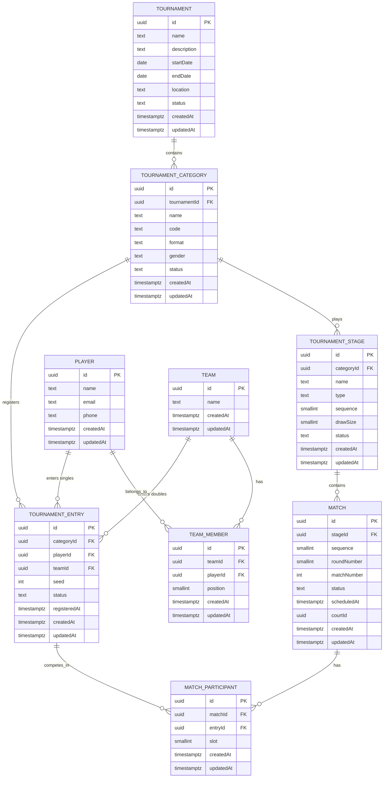

# Phase 2 — Tournament Domain & Database Design

> **Status:** design for review. No schema, migration, API, service, repository or UI
> change accompanies this document. See [Deferred functionality](#19-deferred-functionality).

## 1. Scope

Phase 2 designs the tournament domain and its relational database model. It is a
**design-only** phase: the goal is to settle the model now so that tournament setup,
registration, doubles teams, group scheduling, scoring, knockout progression, court
allocation, live dashboards, realtime updates and statistics can be built later
without rewriting tables or migrations.

In scope:

- A normalized, data-driven model for tournaments, categories, players, teams,
  entries, stages, matches and match participants.
- Explicit primary/foreign keys, nullability, uniqueness, indexes and referential
  actions.
- A proposed Prisma schema (shown for reference, **not applied**).
- Database-level constraints, including those Prisma cannot express.
- Domain invariants, lifecycle/mutability rules, API and validation boundaries,
  repository/service architecture, a test strategy and a list of deferred features.

Out of scope: any implementation. The Phase 1 model `SystemMetadata` is unchanged, no
new dependency is introduced and no package version is touched.

## 2. Domain overview

A **tournament** is an event held at a place over a date range. It contains one or
more **categories** (e.g. "Men's Singles", "Mixed Doubles"). A category is a
_competition_: something a competitor can enter and win. Who competes depends on the
category **format** — an individual **player** for singles, a **team** for doubles.

The concept that unifies both is the **tournament entry**: the registration of one
competitor into one category. A category is played through one or more **stages**
(a group stage, then a knockout). Each stage contains **matches**, and each match has
**participants**, where a participant is a tournament entry. Nothing in the match layer
knows whether an entry is backed by a player or a team, so the same match abstraction
serves singles and doubles.

Key modelling decisions, stated once and repeated in
[Architectural decisions](#18-architectural-decisions):

- The **competitor** abstraction is `TournamentEntry`, not `Player` and not `Team`.
- Matches reference entries, never players or teams directly.
- Category format is **data**, not hard-coded columns or one enum arm per category.
- **Player profiles** are intentionally thin; ranking, stats, photos, auth and payments
  are later concerns.

## 3. Conceptual model

Non-technical view:

```text
Tournament
  |
  +-- Category  (Men's Singles, Women's Doubles, Mixed Doubles, ...)
  |     |
  |     +-- Entry ------ Player                      (singles: one player)
  |     |
  |     +-- Entry ------ Team ------ Player A         (doubles: one team of two players)
  |     |                       \---- Player B
  |     |
  |     +-- Stage (Group) --- Match --- two participants, both Entries
  |     +-- Stage (Knockout) - Match --- two participants, both Entries
  |
  +-- ... more categories
```

The unifying idea: **singles entry = player, doubles entry = team, match participant =
entry.** Every match, of any format, is two entries facing each other.

## 4. Entity definitions

Conventions used throughout:

- `id` — surrogate primary key, UUID (see [§7 IDs](#7-identifier-strategy)).
- `createdAt` / `updatedAt` — `timestamptz`, UTC (see [§8 Timestamps](#8-timestamps)).
- `status` — stored as a string column constrained by a database `CHECK`/native enum;
  see each entity.
- Table names are `snake_case`, plural (`tournaments`, `tournament_categories`, ...).

### 4.1 Tournament

**Purpose.** A single tournament/event, the aggregate root of the domain.

| Field         | Type        | Null | Notes                                  |
| ------------- | ----------- | ---- | -------------------------------------- |
| `id`          | uuid        | no   | PK                                     |
| `name`        | text        | no   | 1–200 chars, trimmed; uniqueness below |
| `description` | text        | yes  | Free text                              |
| `startDate`   | date        | no   | Calendar date, no time component       |
| `endDate`     | date        | no   | `endDate >= startDate` (CHECK)         |
| `location`    | text        | yes  | Venue/place, free text at this phase   |
| `status`      | text        | no   | Lifecycle enum, default `DRAFT`        |
| `createdAt`   | timestamptz | no   | `now()`                                |
| `updatedAt`   | timestamptz | no   | `@updatedAt`                           |

**Primary key.** `id`.
**Foreign keys.** None. Tournament is the root.
**Unique constraints.** A partial unique index on `lower(name)` **only for non-terminal
statuses** (`DRAFT`, `REGISTRATION_OPEN`, `REGISTRATION_CLOSED`, `IN_PROGRESS`), so the
same name cannot be reused while an event is live, but a `COMPLETED`/`CANCELLED` event
can later be repeated with the same name (an annual tournament). Plain `@@unique([name])`
is rejected because "Summer Open" recurs every year.
**Indexes.** `status` (list/filter active events), `startDate` (ordering/calendar).
**Relationships.** 1—N `TournamentCategory`.
**Lifecycle.** `DRAFT → REGISTRATION_OPEN → REGISTRATION_CLOSED → IN_PROGRESS →
COMPLETED`, with `CANCELLED` reachable from any non-terminal state. See
[§13 Lifecycle rules](#13-lifecycle-and-mutability-rules).
**Invariants.** `endDate >= startDate`; name non-empty; status within the allowed set.
**Extensibility.** Contact/organiser, entry fees, timezone and per-tournament defaults
are additive nullable columns. Do **not** add category-specific fields here.

### 4.2 Tournament Category

**Purpose.** A competition within a tournament. The unit that players register _into_.

| Field          | Type        | Null | Notes                                                       |
| -------------- | ----------- | ---- | ----------------------------------------------------------- |
| `id`           | uuid        | no   | PK                                                          |
| `tournamentId` | uuid        | no   | FK → `tournaments.id`, `ON DELETE RESTRICT`                 |
| `name`         | text        | no   | Display name, e.g. "Men's Doubles"                          |
| `code`         | text        | no   | Stable short slug, e.g. `MS`, `WD`, `XD`                    |
| `format`       | text        | no   | `SINGLES` \| `DOUBLES` (see below)                          |
| `gender`       | text        | yes  | `MEN` \| `WOMEN` \| `MIXED` \| `OPEN`, nullable             |
| `status`       | text        | no   | `DRAFT` \| `OPEN` \| `CLOSED` \| `COMPLETED` \| `CANCELLED` |
| `createdAt`    | timestamptz | no   | `now()`                                                     |
| `updatedAt`    | timestamptz | no   | `@updatedAt`                                                |

**Primary key.** `id`.
**Foreign keys.** `tournamentId`.
**Unique constraints.** `UNIQUE (tournamentId, code)` (stable, machine-facing) and a
unique index on `(tournamentId, lower(name))` (no two categories with the same display
name inside one tournament). Across tournaments names repeat freely.
**Indexes.** `tournamentId` (fetch a tournament's categories).
**Relationships.** N—1 `Tournament`; 1—N `TournamentEntry`; 1—N `TournamentStage`.
**Lifecycle.** `DRAFT` while being configured; `OPEN` while accepting entries; `CLOSED`
once entries are locked; `COMPLETED`/`CANCELLED` terminal.
**Invariants.** `code` matches `^[A-Z0-9]{1,8}$`; `gender` is required when format or
naming implies it but is left nullable so future categories (e.g. "Veterans", "U17")
do not need a schema change; a category cannot be deleted once entries exist (see
[§14 Referential actions](#14-referential-actions)).
**Format representation.** `format` is a small closed set of _behavioural_ kinds —
`SINGLES` and `DOUBLES` change how entries are validated, how teams behave and how many
players a side has. It is therefore a genuine enum. **Category identity** ("Men's
Singles", "Mixed Doubles") is intentionally **not** an enum: it is data, so new
categories never require a migration. This is the central anti-hard-coding rule.
**Extensibility.** Age group, skill level, draw size, seeding policy, match format
(best-of-3) become nullable columns later. Also consider `TEAM` (3+ players) as a future
`format` value; the enum can be extended, or the column relaxed to text with a CHECK.

### 4.3 Player

**Purpose.** A real person who participates. Deliberately thin.

| Field       | Type        | Null | Notes                      |
| ----------- | ----------- | ---- | -------------------------- |
| `id`        | uuid        | no   | PK                         |
| `name`      | text        | no   | Display name, 1–200 chars  |
| `email`     | text        | yes  | Optional; uniqueness below |
| `phone`     | text        | yes  | Optional; uniqueness below |
| `createdAt` | timestamptz | no   | `now()`                    |
| `updatedAt` | timestamptz | no   | `@updatedAt`               |

**Primary key.** `id`.
**Foreign keys.** None.
**Unique constraints.** Both `email` and `phone` are **nullable and uniquely indexed
only when non-null** (`WHERE email IS NOT NULL`, `WHERE phone IS NOT NULL`), and compared
case-insensitively for email. Null is _not_ considered a duplicate, which is exactly the
SQL semantics of a partial unique index and the reason it is used instead of Prisma's
`@unique` (which would be a plain unique index and still allows multiple NULLs in
Postgres — acceptable, but partial is explicit and documents intent).
**Indexes.** `name` for admin search; the two partial unique indexes above.
**Relationships.** 1—N `TournamentEntry` (as the singles competitor); 1—N `TeamMember`.
**Lifecycle.** Created on first registration; effectively immutable except contact
details.
**Invariants.** `name` non-empty; email/phone optional but unique when present; a player
is never deleted while referenced by an entry or team membership (`RESTRICT`).
**Explicitly deferred.** Rankings, ratings, statistics, photos, payment info,
authentication, addresses, date of birth, nationality, handedness.
**Extensibility.** A nullable `userId` FK to an auth table later links a player to a
login without changing existing rows.

### 4.4 Team

**Purpose.** A doubles pairing/competitor, without duplicating player data.

| Field       | Type        | Null | Notes                            |
| ----------- | ----------- | ---- | -------------------------------- |
| `id`        | uuid        | no   | PK                               |
| `name`      | text        | no   | Display label, e.g. "Ng / Smith" |
| `createdAt` | timestamptz | no   | `now()`                          |
| `updatedAt` | timestamptz | no   | `@updatedAt`                     |

**Primary key.** `id`.
**Foreign keys.** None directly (members live in `TeamMember`).
**Unique constraints.** None on `name` — team names are not assumed globally unique.
**Indexes.** `name` optional for search.
**Relationships.** 1—N `TeamMember`; 1—N `TournamentEntry`.
**Lifecycle.** Created with its members; membership is mutable until the team has a
`CONFIRMED`/locked entry; immutable once the category is `IN_PROGRESS`.
**Reusable vs tournament-specific vs category-specific — decision: globally
reusable**, i.e. a team is an independent roster. Reasoning:

- The same two people commonly re-pair across categories (Men's Doubles _and_ a
  knockout side-event) and across tournaments. Forcing a new team row per
  tournament/category duplicates membership and invites drift ("Player B changed
  spelling in one row").
- Reuse keeps `Team` a pure roster. Tournament- and category-specific attributes
  (seed, group, penalty) belong to the **entry**, which already scopes to a category.
- Nullable `tournamentId`/`categoryId` on `Team` would be the worst of both: mostly
  NULL columns and an invariant "these two must be set together", which is exactly the
  polymorphic smell we are avoiding in `TournamentEntry`.
  Alternatives considered: tournament-scoped teams (simpler uniqueness, but duplicated
  rosters) and category-scoped teams (matches how a draw sees a pair, but multiplies
  rows and complicates reuse). Global roster wins on normalization.
  **Invariants.** A team has 1..N members at the data level; the _format_ invariant
  (exactly 2 for `DOUBLES`) is enforced in the domain/database per
  [§12 Domain invariants](#12-domain-invariants). A player appears at most once per team.
  **Extensibility.** A `TeamMember.role` or captain flag, or a nullable `homeClubId`, can
  be added later.

### 4.5 Team Member

**Purpose.** Join table between `Team` and `Player`; models the roster.

| Field       | Type        | Null | Notes                                         |
| ----------- | ----------- | ---- | --------------------------------------------- |
| `id`        | uuid        | no   | PK (see note)                                 |
| `teamId`    | uuid        | no   | FK → `teams.id`, `ON DELETE CASCADE`          |
| `playerId`  | uuid        | no   | FK → `players.id`, `ON DELETE RESTRICT`       |
| `position`  | smallint    | no   | 1-based slot/order within the team; default 1 |
| `createdAt` | timestamptz | no   | `now()`                                       |
| `updatedAt` | timestamptz | no   | `@updatedAt`                                  |

**Primary key.** Surrogate `id` **plus** a business composite unique
`UNIQUE (teamId, playerId)`.
**Why a surrogate PK rather than composite PK `(teamId, playerId)`.** A composite PK is
workable, but a surrogate keeps the row addressable and mutation-friendly (change a
player in one slot) and matches the UUID convention used everywhere else; consistency
was chosen over saving four bytes.
**Order/position.** Yes, an explicit `position` is required. Line-up order matters for
presentation ("Player 1 / Player 2") and for deterministic seeding/team-display later.
Alternative considered: order by `createdAt` — rejected because reordering means
delete-and-recreate, and timestamps can tie.
**Unique constraints.** `UNIQUE (teamId, playerId)` prevents the same player twice in a
team. A partial unique index `UNIQUE (teamId, position)` is **not** added now, because
enforcing exact positions is a domain rule tied to format; documented as a future
constraint.
**Indexes.** `teamId`; `playerId` (answer "which teams is this player on").
**Relationships.** N—1 `Team`; N—1 `Player`.
**Invariants.** No duplicate `(teamId, playerId)`; each team has at least one member
(database-enforced by a deferred constraint trigger, see §10); the "exactly 2 for
doubles" rule is a domain/service invariant plus an automated test.
**Explicit note.** The same player **may** belong to many teams across categories and
tournaments. We deliberately do **not** put a unique constraint on `playerId` alone.

### 4.6 Tournament Entry (Registration)

**Purpose.** The competitor registered into one category. The keystone entity.

| Field          | Type        | Null | Notes                                                         |
| -------------- | ----------- | ---- | ------------------------------------------------------------- |
| `id`           | uuid        | no   | PK                                                            |
| `categoryId`   | uuid        | no   | FK → `tournament_categories.id`, `ON DELETE RESTRICT`         |
| `playerId`     | uuid        | yes  | FK → `players.id`, `ON DELETE RESTRICT`; required for singles |
| `teamId`       | uuid        | yes  | FK → `teams.id`, `ON DELETE RESTRICT`; required for doubles   |
| `seed`         | integer     | yes  | Optional draw seed; positive when present                     |
| `status`       | text        | no   | `PENDING` \| `CONFIRMED` \| `WITHDRAWN` \| `DISQUALIFIED`     |
| `registeredAt` | timestamptz | no   | `now()`                                                       |
| `createdAt`    | timestamptz | no   | `now()`                                                       |
| `updatedAt`    | timestamptz | no   | `@updatedAt`                                                  |

**Primary key.** `id`.
**Foreign keys.** `categoryId`, `playerId` (nullable), `teamId` (nullable).
**The "exactly one competitor" design.** `playerId` and `teamId` are both nullable, with
the invariant **exactly one is non-null**. This is chosen over the alternatives
(document them in §20) for these reasons:

1. Both FKs are _real_ foreign keys to _real_ tables, so referential integrity is
   enforced by Postgres. A polymorphic `(competitorType, competitorId)` column pair
   cannot have a single FK and would silently allow dangling ids.
2. The match layer queries entries uniformly — no joins on a type discriminator.
3. Adding a third competitor kind later (a "pair" or "club") is additive: one more
   nullable FK plus one more arm of the CHECK.

Enforcement is layered:

- **Database (required):** a `CHECK` constraint
  `(player_id IS NOT NULL)::int + (team_id IS NOT NULL)::int = 1` guarantees exactly
  one. This is the authoritative integrity rule.
- **Cross-table (required, SQL trigger):** `format` compatibility — a `SINGLES`
  category must have `player_id` set, a `DOUBLES` category must have `team_id` set.
  A `CHECK` cannot see another table, so a `BEFORE INSERT OR UPDATE` trigger
  `assert_entry_competitor_matches_format()` on `tournament_entries` reads
  `tournament_categories.format` and raises on mismatch. Documented as raw SQL in
  §10 because Prisma cannot express it.
- **Domain/service:** format compatibility and team-size rules are also enforced in
  the registration service so callers get a typed error before touching the database.
  Prisma validation alone is explicitly **not** relied upon.
  **Unique constraints.**
- Singles: `UNIQUE (categoryId, playerId) WHERE playerId IS NOT NULL` — a player
  enters a category once.
- Doubles: `UNIQUE (categoryId, teamId) WHERE teamId IS NOT NULL` — a team enters a
  category once.
  Two partial unique indexes rather than one composite, because a composite over two
  nullable columns would not do what is intended (NULLs compare distinct).
- Optional richer rule "same _player_ cannot be on two teams in the same category"
  (anti-collusion/duplicate entry) is a **domain invariant** left as an open question
  (§22); it needs a join to `TeamMember` and is not added now.
  **Indexes.** `categoryId` (list a draw's entries); the partial unique indexes above also
  serve `playerId` / `teamId` lookups, and an additional plain index on `teamId` supports
  "all entries for this team" clearly.
  **Relationships.** N—1 `TournamentCategory`, N—1 `Player` (nullable), N—1 `Team`
  (nullable); 1—N `MatchParticipant`.
  **Lifecycle.** `PENDING` (submitted, not yet accepted) → `CONFIRMED` (accepted, may be
  seeded/placed) → optionally `WITHDRAWN` (pulled before/at start) or `DISQUALIFIED`
  (removed by organiser). See §13 for which states are reachable when.
  **Are all four statuses needed now?** Review of alternatives: a boolean `confirmed`
  cannot express withdrawal/disqualification and cannot carry the audit meaning; adding a
  fifth state (`WAITLIST`) is speculative. The four chosen states are the minimum that
  (a) supports the registration flow the product needs, (b) lets an entry exist after
  leaving the draw so match history stays intact, and (c) is a closed set that can grow
  additively. Keep them.
  **Invariants.** Exactly one competitor (CHECK); competitor kind matches category format
  (trigger); no duplicate registration per category (partial uniques); `seed > 0` when
  set; an entry may not be deleted once it has match participants (RESTRICT via
  `MatchParticipant`).
  **Extensibility.** `notes`, `registeredByUserId`, `partnerRequest`, withdrawal reason
  and timestamps are additive.

### 4.7 Tournament Stage

**Purpose.** A competitive phase inside a category (group stage, then knockout rounds).

| Field        | Type        | Null | Notes                                                 |
| ------------ | ----------- | ---- | ----------------------------------------------------- |
| `id`         | uuid        | no   | PK                                                    |
| `categoryId` | uuid        | no   | FK → `tournament_categories.id`, `ON DELETE RESTRICT` |
| `name`       | text        | no   | e.g. "Group Stage", "Semi Final"                      |
| `type`       | text        | no   | `GROUP` \| `KNOCKOUT`                                 |
| `sequence`   | smallint    | no   | 1-based order within the category                     |
| `drawSize`   | smallint    | yes  | Optional planned size (groups: 4, knockout: 8)        |
| `status`     | text        | no   | `PENDING` \| `ACTIVE` \| `COMPLETED`                  |
| `createdAt`  | timestamptz | no   | `now()`                                               |
| `updatedAt`  | timestamptz | no   | `@updatedAt`                                          |

**Primary key.** `id`.
**Foreign keys.** `categoryId`.
**Unique constraints.** `UNIQUE (categoryId, sequence)` — deterministic ordering and no
two stages occupying the same slot. `UNIQUE (categoryId, name)` if names are expected
unique within a category (recommended).
**Indexes.** `categoryId`.
**Relationships.** N—1 `TournamentCategory`; 1—N `Match`.
**Lifecycle.** `PENDING` → `ACTIVE` → `COMPLETED`.
**Stage types — is `GROUP`/`KNOCKOUT` enough now?** Yes for this phase. The type
determines what a future generator does and, later, how standings versus brackets are
derived. A third type is foreseeable but not needed: a knockout "round" (e.g. Semi
Final) is a _stage_ with its own sequence and matches, not a new type. If a
consolation/placement playoff appears, it is still `KNOCKOUT`. A future
`ROUND_ROBIN_LEAGUE` (no groups, one table) would be a new value; the enum can be
extended without touching existing rows. Prefer an enum for the same reason as category
format: a closed set of _behavioural_ kinds.
**Ordering.** Explicit `sequence` rather than relying on `createdAt`, so reordering a
stage (insert a group stage before a knockout) is a data edit and stays deterministic.
**Extensibility.** `groupCount`, `advancePerGroup`, bracket metadata and per-stage match
format belong to a later phase or a nullable config column.

### 4.8 Match

**Purpose.** Foundation record of a fixture within a stage. No scoring or algorithms.

| Field         | Type        | Null | Notes                                                                    |
| ------------- | ----------- | ---- | ------------------------------------------------------------------------ |
| `id`          | uuid        | no   | PK                                                                       |
| `stageId`     | uuid        | no   | FK → `tournament_stages.id`, `ON DELETE RESTRICT`                        |
| `sequence`    | smallint    | no   | 1-based order within the stage                                           |
| `roundNumber` | smallint    | yes  | Knockout round index; null for groups                                    |
| `matchNumber` | integer     | yes  | Human-facing/unstable label; nullable                                    |
| `status`      | text        | no   | `SCHEDULED` \| `IN_PROGRESS` \| `COMPLETED` \| `CANCELLED` \| `WALKOVER` |
| `scheduledAt` | timestamptz | yes  | Optional planned start (see §8)                                          |
| `courtId`     | uuid        | yes  | Reserved for a future `Court`; not implemented                           |
| `createdAt`   | timestamptz | no   | `now()`                                                                  |
| `updatedAt`   | timestamptz | no   | `@updatedAt`                                                             |

**Primary key.** `id`.
**Foreign keys.** `stageId` now; `courtId` is deliberately **not** declared until a
`Court` table exists (see §22) — adding an FK later is a one-line migration.
**Unique constraints.** `UNIQUE (stageId, sequence)` — deterministic match order and no
slot collisions.
**Do we need `roundNumber` and `matchNumber`?**

- `roundNumber` — yes. Knockout stages need a round index (Round of 16, QF, SF, F)
  independent of `sequence`, so the same stage can span several rounds and future
  progression logic can group by round. Nullable because a group stage has no rounds.
- `matchNumber` — nullable and _not_ load-bearing. Useful as a display label but not
  required; kept nullable so a generator can fill it later without blocking inserts.
- `status` — yes. The dashboard and court screens need to know whether a match is
  scheduled, live, finished, cancelled or a walkover. Values are a closed set.
- Deliberately **absent**: scores, sets, points, winner, court geometry, live state.
  Those arrive in later phases (see §19) and are additive.
  **Indexes.** `stageId` (all matches of a stage); `status` (court/live dashboards).
  **Relationships.** N—1 `TournamentStage`; 1..2 `MatchParticipant` (normally exactly 2).
  **Lifecycle.** `SCHEDULED → IN_PROGRESS → COMPLETED`, with `CANCELLED`/`WALKOVER`
  terminal alternatives. Lifecycle is _recorded_ now, but transitions are not enforced
  until scoring exists.
  **Invariants.** Belongs to exactly one stage; `(stageId, sequence)` unique; a completed
  match cannot lose its participants.
  **Extensibility.** A `MatchResult`/`Game`/`GameScore` table, `courtId`, `scheduledAt`
  refinement, and knockout source references (`winnerOfMatchId`, `loserOfMatchId`,
  `sourceGroupId`, `sourcePosition`) are planned additions, not part of this phase.

### 4.9 Match Participant

**Purpose.** The competitors in a match: two entries facing each other.

| Field       | Type        | Null | Notes                                               |
| ----------- | ----------- | ---- | --------------------------------------------------- |
| `id`        | uuid        | no   | PK                                                  |
| `matchId`   | uuid        | no   | FK → `matches.id`, `ON DELETE CASCADE`              |
| `entryId`   | uuid        | no   | FK → `tournament_entries.id`, `ON DELETE RESTRICT`  |
| `slot`      | smallint    | no   | 1 = side A, 2 = side B (not a text enum; see below) |
| `createdAt` | timestamptz | no   | `now()`                                             |
| `updatedAt` | timestamptz | no   | `@updatedAt`                                        |

**Primary key.** `id`.
**Foreign keys.** `matchId`, `entryId`.
**Relationships.** N—1 `Match`; N—1 `TournamentEntry`. **Never** Player or Team — that
is the rule that keeps the match layer format-agnostic.
**Slot representation.** `smallint` constrained by `CHECK (slot IN (1, 2))`, chosen over
a text `'A'/'B'` enum: it sorts naturally, matches "side 1/side 2" in future score rows,
and is cheap. `A`/`B` remain the display labels.
**Unique constraints.**

- `UNIQUE (matchId, slot)` — one entry per side; prevents the same entry occupying
  both sides (invariant 11).
- `UNIQUE (matchId, entryId)` — the same entry cannot appear twice in a match, even in
  different slots.
  **Indexes.** The unique constraints index `(matchId, slot)` and `(matchId, entryId)`;
  both already serve lookups by `matchId` and by `entryId`, so no extra plain index is
  needed.
  **Invariants.** References exactly one entry; no duplicate entry per match; slot in
  {1,2}; normally exactly two participants per non-cancelled match (a domain/service rule;
  a walkover can record only the advancing side plus a status, decided later).
  **Extensibility.** Per-side score summary, retirement reason, or a `winnerEntryId` on
  `Match` (rather than here) are later additions.

## 5. Relationships

```text
Tournament          1 ──── N TournamentCategory
TournamentCategory  1 ──── N TournamentEntry
TournamentCategory  1 ──── N TournamentStage
Player              1 ──── N TournamentEntry        (nullable side: singles)
Team                1 ──── N TournamentEntry        (nullable side: doubles)
Team                1 ──── N TeamMember
Player              1 ──── N TeamMember
TournamentStage     1 ──── N Match
Match               1 ──── N MatchParticipant
TournamentEntry     1 ──── N MatchParticipant
```

Are these sufficient? Yes for the phase-2 foundations. Notes:

- An entry reaches exactly one category, and through it one tournament. There is no
  direct `entry.tournamentId`; adding one would denormalize and risk disagreement with
  the category's tournament.
- A match reaches its category/tournament through `stage.category.tournament`.
- `MatchParticipant` carries the 1..2 cardinality. A `Match` with one participant is
  only meaningful for a walkover/bye and is a status concern, not a relationship
  concern.
- Future join tables that do **not** change this skeleton: group membership
  (`StageGroup` + `GroupEntry`), knockout source references, `Court`, `Game`/`GameScore`.

## 6. ER diagram

Full ER diagram (Mermaid). Primary keys are marked `PK`, foreign keys `FK`.



The simplified conceptual diagram for non-technical review is in
[§3 Conceptual model](#3-conceptual-model).

## 7. Identifier strategy

**Decision: UUID (v4) generated by the database via `gen_random_uuid()` / Prisma
`@default(uuid())` for every domain entity, matching Phase 1's `SystemMetadata`.**

Reasoning:

- **Consistency.** Phase 1 already uses `String @id @default(uuid())`. Introducing a
  second strategy (cuid, integer, ULID) for domain rows would be gratuitous variety.
- **Client-generatable.** UUIDs let an offline or optimistic client create a row id
  before the server assigns it, which matters for realtime/Supabase later.
- **Non-enumerable.** API paths never expose sequential counts.
- **Merge-friendly.** No sequence coordination is needed if data is ever imported or
  merged across environments, which matters for the Supabase production plan.

Details:

- **Generation.** Database-generated default (`gen_random_uuid()`, available with no
  extension on PostgreSQL 13+; `pgcrypto` otherwise). Application code may also generate
  a UUID when it needs the id before insert; the default is the backstop.
- **Storage.** Native `uuid` column type (16 bytes) rather than `text`. Phase 1 stored
  `String`; for domain tables prefer native `uuid` for type safety and smaller indexes.
  The exact Prisma spelling (`String @db.Uuid` versus a `uuid` field type) is fixed at
  implementation time and does not change the decision.
- **Application expectation.** Ids are `string` in TypeScript, opaque, never parsed or
  treated as numbers. `packages/domain` types use `readonly id: string`.
- **API exposure.** Ids are returned as-is in resources and used as path params,
  validated with `z.uuid()` (Zod 4) before use.
- **Indexing.** Primary-key indexes are B-tree on the `uuid` column. Random v4 ids make
  inserts non-sequential; for a tournament workload (hundreds to a few hundred thousand
  rows) this is irrelevant. If insert locality ever matters, switching _generation_ to
  UUIDv7 is possible without changing the column type or API — noted as a future option.
- **Not chosen:** auto-increment integers (enumerable, awkward for client-generated ids,
  merge-hostile), cuid2 (adds a dependency for no Phase-2 benefit), ULID (no advantage
  over native UUID here).

## 8. Timestamps

**Decision:** every entity carries `createdAt` and `updatedAt`, both
`timestamp with time zone` (`timestamptz`), stored in **UTC**, defaulted to `now()` and
maintained by Prisma `@updatedAt`.

- **Timezone expectation.** `timestamptz` stores an absolute instant and displays in the
  session timezone; it is never ambiguous the way `timestamp without time zone` is.
  Servers, CI and Supabase all run in UTC. API responses serialise as ISO-8601 UTC
  (`2026-09-27T07:00:00.000Z`); the browser formats to local time for display.
- **Three distinct time concepts**, deliberately separated:
  1. **Calendar date** — `Tournament.startDate` / `endDate` are `date`, not timestamps.
     A tournament that "runs 3–5 October" has no time-of-day; storing it as a timestamp
     would invent a midnight and invite timezone bugs. `date` is the correct type.
  2. **Scheduled / live instant** — `Match.scheduledAt` (and future scoring timestamps)
     are `timestamptz`, an absolute moment. This is the only place a clock time is
     meaningful, and it is optional and unpopulated this phase.
  3. **Record timestamps** — `createdAt`/`updatedAt` are `timestamptz`, bookkeeping only.
- **Local tournament time** (e.g. "matches start 09:00 local") is a _presentation and
  scheduling_ concern. If a future phase needs to pin a wall-clock start, add an explicit
  `timezone` (IANA name) column on `Tournament` and interpret local times against it — do
  not store ambiguous local timestamps. Documented, not implemented.
- **`updatedAt` maintenance.** Kept at the application layer initially (Prisma
  `@updatedAt`) to match Phase 1; a database trigger is an option if writes ever bypass
  the repository. Not required now.

## 9. Proposed Prisma schema (reference only — NOT applied)

> This is the design proposal. `prisma/schema.prisma` is **not** modified in this phase.
> The block below is illustrative: exact field-type spellings (`@db.Uuid`, native enums
> versus `String` + `CHECK`) are finalised at implementation time. `SystemMetadata`
> stays exactly as it is and would remain in the same file.

```prisma
// ---------------------------------------------------------------------------
// Phase 2 tournament domain (PROPOSAL - not applied in this phase)
// ---------------------------------------------------------------------------

enum TournamentStatus {
  DRAFT
  REGISTRATION_OPEN
  REGISTRATION_CLOSED
  IN_PROGRESS
  COMPLETED
  CANCELLED
}

enum CategoryFormat {
  SINGLES
  DOUBLES
}

enum CategoryGender {
  MEN
  WOMEN
  MIXED
  OPEN
}

enum CategoryStatus {
  DRAFT
  OPEN
  CLOSED
  COMPLETED
  CANCELLED
}

enum EntryStatus {
  PENDING
  CONFIRMED
  WITHDRAWN
  DISQUALIFIED
}

enum StageType {
  GROUP
  KNOCKOUT
}

enum StageStatus {
  PENDING
  ACTIVE
  COMPLETED
}

enum MatchStatus {
  SCHEDULED
  IN_PROGRESS
  COMPLETED
  CANCELLED
  WALKOVER
}

model Tournament {
  id          String               @id @default(uuid()) @db.Uuid
  name        String
  description String?
  startDate   DateTime             @db.Date
  endDate     DateTime             @db.Date
  location    String?
  status      TournamentStatus     @default(DRAFT)
  categories  TournamentCategory[]
  createdAt   DateTime             @default(now())
  updatedAt   DateTime             @updatedAt

  @@index([status])
  @@index([startDate])
  @@map("tournaments")
}

model TournamentCategory {
  id           String             @id @default(uuid()) @db.Uuid
  tournamentId String             @db.Uuid
  tournament   Tournament         @relation(fields: [tournamentId], references: [id], onDelete: Restrict)
  name         String
  code         String
  format       CategoryFormat
  gender       CategoryGender?
  status       CategoryStatus     @default(DRAFT)
  entries      TournamentEntry[]
  stages       TournamentStage[]
  createdAt    DateTime           @default(now())
  updatedAt    DateTime           @updatedAt

  @@unique([tournamentId, code])
  @@index([tournamentId])
  @@map("tournament_categories")
}

model Player {
  id          String            @id @default(uuid()) @db.Uuid
  name        String
  email       String?           @unique
  phone       String?           @unique
  entries     TournamentEntry[]
  teamMembers TeamMember[]
  createdAt   DateTime          @default(now())
  updatedAt   DateTime          @updatedAt

  @@map("players")
}

model Team {
  id        String            @id @default(uuid()) @db.Uuid
  name      String
  members   TeamMember[]
  entries   TournamentEntry[]
  createdAt DateTime          @default(now())
  updatedAt DateTime          @updatedAt

  @@map("teams")
}

model TeamMember {
  id        String   @id @default(uuid()) @db.Uuid
  teamId    String   @db.Uuid
  team      Team     @relation(fields: [teamId], references: [id], onDelete: Cascade)
  playerId  String   @db.Uuid
  player    Player   @relation(fields: [playerId], references: [id], onDelete: Restrict)
  position  Int      @default(1)
  createdAt DateTime @default(now())
  updatedAt DateTime @updatedAt

  @@unique([teamId, playerId])
  @@index([teamId])
  @@index([playerId])
  @@map("team_members")
}

model TournamentEntry {
  id           String             @id @default(uuid()) @db.Uuid
  categoryId   String             @db.Uuid
  category     TournamentCategory @relation(fields: [categoryId], references: [id], onDelete: Restrict)
  playerId     String?            @db.Uuid
  player       Player?            @relation(fields: [playerId], references: [id], onDelete: Restrict)
  teamId       String?            @db.Uuid
  team         Team?              @relation(fields: [teamId], references: [id], onDelete: Restrict)
  seed         Int?
  status       EntryStatus        @default(PENDING)
  registeredAt DateTime           @default(now())
  participants MatchParticipant[]
  createdAt    DateTime           @default(now())
  updatedAt    DateTime           @updatedAt

  @@index([categoryId])
  @@index([teamId])
  @@map("tournament_entries")
}

model TournamentStage {
  id         String             @id @default(uuid()) @db.Uuid
  categoryId String             @db.Uuid
  category   TournamentCategory @relation(fields: [categoryId], references: [id], onDelete: Restrict)
  name       String
  type       StageType
  sequence   Int
  drawSize   Int?
  status     StageStatus        @default(PENDING)
  matches    Match[]
  createdAt  DateTime           @default(now())
  updatedAt  DateTime           @updatedAt

  @@unique([categoryId, sequence])
  @@index([categoryId])
  @@map("tournament_stages")
}

model Match {
  id           String             @id @default(uuid()) @db.Uuid
  stageId      String             @db.Uuid
  stage        TournamentStage    @relation(fields: [stageId], references: [id], onDelete: Restrict)
  sequence     Int
  roundNumber  Int?
  matchNumber  Int?
  status       MatchStatus        @default(SCHEDULED)
  scheduledAt  DateTime?
  courtId      String?            @db.Uuid // FK to a future Court table
  participants MatchParticipant[]
  createdAt    DateTime           @default(now())
  updatedAt    DateTime           @updatedAt

  @@unique([stageId, sequence])
  @@index([stageId])
  @@index([status])
  @@map("matches")
}

model MatchParticipant {
  id        String          @id @default(uuid()) @db.Uuid
  matchId   String          @db.Uuid
  match     Match           @relation(fields: [matchId], references: [id], onDelete: Cascade)
  entryId   String          @db.Uuid
  entry     TournamentEntry @relation(fields: [entryId], references: [id], onDelete: Restrict)
  slot      Int
  createdAt DateTime        @default(now())
  updatedAt DateTime        @updatedAt

  @@unique([matchId, slot])
  @@unique([matchId, entryId])
  @@index([entryId])
  @@map("match_participants")
}
```

**Prisma cannot express**, and therefore needs hand-written SQL in the migration:

- `CHECK (end_date >= start_date)` on `tournaments`.
- `CHECK (seed IS NULL OR seed > 0)` on `tournament_entries`.
- The exactly-one-competitor `CHECK` on `tournament_entries`.
- `CHECK (slot IN (1, 2))` on `match_participants`.
- The format-compatibility **trigger** on `tournament_entries`.
- Partial unique indexes: active tournament name, player email/phone, per-category
  player entry, per-category team entry.
- The "team has at least one member" deferred constraint trigger.
- Relaxing `@unique` on `email`/`phone` to partial unique indexes (Prisma `@unique`
  emits a plain unique index; partial indexes are added by SQL and the Prisma attribute
  removed).

`String? @unique` on `email`/`phone` above is shown for readability; the final schema
drops the Prisma `@unique` in favour of the SQL partial unique index, because two NULLs
must not collide and the partial index makes the rule explicit and case-insensitive.

## 10. Constraints

### 10.1 Primary keys

Every table has a single-column `uuid` primary key (see §7).

### 10.2 Foreign keys

| Child                   | Column          | Parent                  | On delete  |
| ----------------------- | --------------- | ----------------------- | ---------- |
| `tournament_categories` | `tournament_id` | `tournaments`           | `RESTRICT` |
| `tournament_entries`    | `category_id`   | `tournament_categories` | `RESTRICT` |
| `tournament_entries`    | `player_id`     | `players`               | `RESTRICT` |
| `tournament_entries`    | `team_id`       | `teams`                 | `RESTRICT` |
| `team_members`          | `team_id`       | `teams`                 | `CASCADE`  |
| `team_members`          | `player_id`     | `players`               | `RESTRICT` |
| `tournament_stages`     | `category_id`   | `tournament_categories` | `RESTRICT` |
| `matches`               | `stage_id`      | `tournament_stages`     | `RESTRICT` |
| `match_participants`    | `match_id`      | `matches`               | `CASCADE`  |
| `match_participants`    | `entry_id`      | `tournament_entries`    | `RESTRICT` |

All FK columns are `NOT NULL` except `tournament_entries.player_id` and
`tournament_entries.team_id`.

### 10.3 Check constraints

```sql
-- tournaments
ALTER TABLE tournaments
  ADD CONSTRAINT tournaments_date_order CHECK (end_date >= start_date),
  ADD CONSTRAINT tournaments_name_present CHECK (length(btrim(name)) > 0);

-- tournament_categories
ALTER TABLE tournament_categories
  ADD CONSTRAINT tournament_categories_code_format CHECK (code ~ '^[A-Z0-9]{1,8}$');

-- tournament_entries
ALTER TABLE tournament_entries
  ADD CONSTRAINT entries_exactly_one_competitor
    CHECK ((player_id IS NOT NULL)::int + (team_id IS NOT NULL)::int = 1),
  ADD CONSTRAINT entries_seed_positive CHECK (seed IS NULL OR seed > 0);

-- match_participants
ALTER TABLE match_participants
  ADD CONSTRAINT match_participants_slot_valid CHECK (slot IN (1, 2));
```

### 10.4 Partial unique indexes (Prisma cannot emit these)

```sql
-- No two live tournaments share a name; completed/cancelled names are reusable.
CREATE UNIQUE INDEX tournaments_active_name_key
  ON tournaments (lower(name))
  WHERE status IN ('DRAFT', 'REGISTRATION_OPEN', 'REGISTRATION_CLOSED', 'IN_PROGRESS');

-- Category display name unique within a tournament.
CREATE UNIQUE INDEX tournament_categories_name_key
  ON tournament_categories (tournament_id, lower(name));

-- Player contact uniqueness only when present; email case-insensitive.
CREATE UNIQUE INDEX players_email_key
  ON players (lower(email)) WHERE email IS NOT NULL;
CREATE UNIQUE INDEX players_phone_key
  ON players (phone) WHERE phone IS NOT NULL;

-- One singles registration per player per category.
CREATE UNIQUE INDEX entries_category_player_key
  ON tournament_entries (category_id, player_id) WHERE player_id IS NOT NULL;

-- One doubles registration per team per category.
CREATE UNIQUE INDEX entries_category_team_key
  ON tournament_entries (category_id, team_id) WHERE team_id IS NOT NULL;
```

### 10.5 Cross-table invariants Prisma cannot express

**Format compatibility (trigger).** A `CHECK` cannot reference another table, so the
"singles entry must reference a player, doubles entry must reference a team" rule is
enforced by a trigger:

```sql
CREATE OR REPLACE FUNCTION assert_entry_competitor_matches_format()
RETURNS trigger AS $$
DECLARE
  cat_format text;
BEGIN
  SELECT format::text INTO cat_format
    FROM tournament_categories WHERE id = NEW.category_id;

  IF cat_format = 'SINGLES' AND NEW.player_id IS NULL THEN
    RAISE EXCEPTION 'singles entry % must reference a player', NEW.id;
  END IF;
  IF cat_format = 'DOUBLES' AND NEW.team_id IS NULL THEN
    RAISE EXCEPTION 'doubles entry % must reference a team', NEW.id;
  END IF;
  RETURN NEW;
END;
$$ LANGUAGE plpgsql;

CREATE TRIGGER tournament_entries_format_check
  BEFORE INSERT OR UPDATE OF category_id, player_id, team_id
  ON tournament_entries
  FOR EACH ROW EXECUTE FUNCTION assert_entry_competitor_matches_format();
```

**A team must have at least one member (deferred constraint trigger).** Because the
parent row (`teams`) is inserted before its `team_members`, a plain `CHECK` cannot see
the future; a deferred constraint trigger evaluated at `COMMIT` can:

```sql
CREATE OR REPLACE FUNCTION assert_team_has_member()
RETURNS trigger AS $$
BEGIN
  IF NOT EXISTS (SELECT 1 FROM team_members WHERE team_id = NEW.id) THEN
    RAISE EXCEPTION 'team % must have at least one member', NEW.id;
  END IF;
  RETURN NEW;
END;
$$ LANGUAGE plpgsql;

CREATE CONSTRAINT TRIGGER teams_require_member
  AFTER INSERT ON teams
  DEFERRABLE INITIALLY DEFERRED
  FOR EACH ROW EXECUTE FUNCTION assert_team_has_member();
```

**Doubles team size.** "Exactly 2 members for a doubles team" depends on the category
being played, which the team itself does not know (teams are reusable). It is therefore
enforced in the **domain/service** layer when an entry is confirmed, backed by an
automated test -- not by a table `CHECK`. An alternative that pushes it into the database
would require denormalising the format onto the entry and is rejected as premature.

## 11. Index strategy

Indexes follow queries the product will actually issue; nothing is indexed "just in
case".

| Index                                                                  | Kind           | Serves                                                                            |
| ---------------------------------------------------------------------- | -------------- | --------------------------------------------------------------------------------- |
| `tournaments (status)`                                                 | B-tree         | Listing active tournaments and filtering the admin list.                          |
| `tournaments (startDate)`                                              | B-tree         | Ordering by date, "upcoming tournaments", calendar views.                         |
| `tournaments (lower(name)) WHERE active`                               | partial unique | Preventing duplicate live names without blocking reuse.                           |
| `tournament_categories (tournamentId)`                                 | B-tree         | Loading one tournament's categories (the common detail query).                    |
| `tournament_categories (tournamentId, lower(name))`                    | partial unique | Name uniqueness within a tournament.                                              |
| `tournament_categories (tournamentId, code)`                           | unique         | Code uniqueness; also serves code lookup within a tournament.                     |
| `tournament_entries (categoryId)`                                      | B-tree         | Listing a category's draw/entries.                                                |
| `tournament_entries (categoryId, playerId) WHERE playerId IS NOT NULL` | partial unique | No duplicate singles registration; player-entry lookup.                           |
| `tournament_entries (categoryId, teamId) WHERE teamId IS NOT NULL`     | partial unique | No duplicate doubles registration; team-entry lookup.                             |
| `tournament_entries (teamId)`                                          | B-tree         | "All entries for this team" across categories (independent of the partial index). |
| `team_members (teamId)`                                                | B-tree         | Loading a team's roster.                                                          |
| `team_members (playerId)`                                              | B-tree         | "Which teams is this player on".                                                  |
| `team_members (teamId, playerId)`                                      | unique         | No duplicate member in a team (also serves `teamId` lookups).                     |
| `players (lower(email)) WHERE email IS NOT NULL`                       | partial unique | Contact uniqueness and lookup by email.                                           |
| `players (phone) WHERE phone IS NOT NULL`                              | partial unique | Contact uniqueness and lookup by phone.                                           |
| `players (name)`                                                       | B-tree         | Admin search by name.                                                             |
| `tournament_stages (categoryId)`                                       | B-tree         | Loading a category's stages.                                                      |
| `tournament_stages (categoryId, sequence)`                             | unique         | Deterministic stage order; also serves `categoryId`.                              |
| `matches (stageId)`                                                    | B-tree         | Loading a stage's matches.                                                        |
| `matches (stageId, sequence)`                                          | unique         | Deterministic match order; also serves `stageId`.                                 |
| `matches (status)`                                                     | B-tree         | Live/court dashboards filtering scheduled/in-progress matches.                    |
| `match_participants (matchId, slot)`                                   | unique         | One entry per side; serves `matchId` lookups.                                     |
| `match_participants (matchId, entryId)`                                | unique         | No duplicate entry in a match.                                                    |
| `match_participants (entryId)`                                         | B-tree         | All matches for an entry (player/team history).                                   |

Deliberately **not** indexed: `Match.roundNumber` (low cardinality, always scoped by
stage); `Team.name` (no search feature yet); `Tournament.location` (free text, no
query); `Match.scheduledAt` (unused until scheduling exists -- revisit then, possibly as
`(scheduledAt)` with a `status = 'SCHEDULED'` partial predicate).

## 12. Domain invariants

Each invariant is classified by **where it is enforced**: `DB` (database), `SVC`
(domain/service), `UI` (presentation only). The rule is that no integrity-critical
invariant relies on `UI`, and `DB` is authoritative wherever it can be expressed.

| #   | Invariant                                                                | Class                    |
| --- | ------------------------------------------------------------------------ | ------------------------ |
| 1   | A TournamentCategory belongs to exactly one Tournament.                  | DB                       |
| 2   | A TournamentStage belongs to exactly one TournamentCategory.             | DB                       |
| 3   | A TournamentEntry belongs to exactly one TournamentCategory.             | DB                       |
| 4   | A TournamentEntry represents exactly one competitor (player XOR team).   | DB                       |
| 5   | A singles entry must reference a Player.                                 | DB                       |
| 6   | A doubles entry must reference a Team.                                   | DB                       |
| 7   | A doubles team contains exactly two members.                             | SVC                      |
| 8   | A team cannot contain the same player twice.                             | DB                       |
| 9   | A Match belongs to exactly one Stage.                                    | DB                       |
| 10  | A MatchParticipant references exactly one TournamentEntry.               | DB                       |
| 11  | A Match cannot contain the same TournamentEntry twice.                   | DB                       |
| 12  | Tournament dates are logically valid (`endDate >= startDate`).           | DB                       |
| 13  | Stage and match ordering is deterministic (`sequence` unique per scope). | DB                       |
| 14  | Historical records are not destroyed by ordinary CRUD.                   | DB+SVC                   |
| 15  | A player is not registered twice in the same category.                   | DB                       |
| 16  | A team is not registered twice in the same category.                     | DB                       |
| 17  | A Player appears in at most one team per category.                       | SVC (open question, §22) |
| 18  | A team has at least one member.                                          | DB                       |
| 19  | A tournament name is unique among non-terminal tournaments.              | DB                       |
| 20  | A category name/code is unique within its tournament.                    | DB                       |

Notes:

- Invariants 7 and 17 are `SVC` because they require joining the entry to the category
  and the team to its members; both are covered by automated tests. Invariant 17 is
  listed as an open question.
- Invariants 5, 6 and 18 are `DB` via the triggers in §10.5; invariant 4 is a `CHECK`.
- Invariants 15, 16, 19 and 20 are partial/composite unique indexes.
- Invariant 14 is enforced by `RESTRICT` on the structural FKs (§14) plus service-level
  lifecycle guards that refuse to delete a tournament/category with dependent rows.
- **UI validation is never the source of truth.** The UI may mirror rules for immediate
  feedback, but the API/service and database re-check every one.

## 13. Lifecycle and mutability rules

Documented only, not implemented. Terminal states never transition further.

### Tournament

| State                 | Allowed structural changes                                                                        |
| --------------------- | ------------------------------------------------------------------------------------------------- |
| `DRAFT`               | Freely editable: name, dates, location, categories, stages.                                       |
| `REGISTRATION_OPEN`   | Categories may be added; categories with entries may not be deleted or have their format changed. |
| `REGISTRATION_CLOSED` | No new entries. Draw/stages may be generated and seeded.                                          |
| `IN_PROGRESS`         | No structural change. Match records update; entrants are frozen.                                  |
| `COMPLETED`           | Read-only. Historical rows preserved; only admin corrections.                                     |
| `CANCELLED`           | Read-only; may be archived, not deleted if history exists.                                        |

### Category

`DRAFT` freely editable (name/code/format/gender). `OPEN` editable name only; format
frozen once entries exist. `CLOSED` further restricted (seeding allowed), format and
participant set frozen. `IN_PROGRESS`/`COMPLETED`/`CANCELLED` effectively immutable.

### Player / Team / TeamMember

Players and teams are editable while they have no entry in a category that has started.
Team membership is editable until the team's entry is `CONFIRMED` in an `IN_PROGRESS`
category. A player/team referenced by history cannot be hard-deleted (`RESTRICT`);
future phases may add soft-delete flags.

### Entry

`PENDING -> CONFIRMED` while the category is `OPEN`. `CONFIRMED -> WITHDRAWN` before the
category starts. `DISQUALIFIED` may be set by an organiser while the category is
`IN_PROGRESS` or earlier. Once a `CONFIRMED` entry has participants in a started match,
its competitor (player/team reference) is immutable; only `status` may change.

### Match

`SCHEDULED -> IN_PROGRESS -> COMPLETED`; `CANCELLED`/`WALKOVER` are terminal
alternatives. Once `COMPLETED`, participants and (future) scores are immutable except by
an explicit correction operation. Transition _enforcement_ is deferred until scoring
exists; this phase only records status.

## 14. Referential actions

`CASCADE` is used only where the child row has no meaning without the parent and no
history would be lost.

| Relationship                            | Action     | Reasoning                                                                    |
| --------------------------------------- | ---------- | ---------------------------------------------------------------------------- |
| `TeamMember -> Team`                    | `CASCADE`  | A roster line is owned by its team; deleting an unused team removes it.      |
| `TeamMember -> Player`                  | `RESTRICT` | Deleting a player must not silently empty teams and orphan entries.          |
| `TournamentCategory -> Tournament`      | `RESTRICT` | A tournament with categories is not deleted silently; protects invariant 14. |
| `TournamentEntry -> TournamentCategory` | `RESTRICT` | A category with registrations must not vanish.                               |
| `TournamentEntry -> Player`             | `RESTRICT` | An entry must always resolve to its competitor; deletion blocked.            |
| `TournamentEntry -> Team`               | `RESTRICT` | Same as above for doubles.                                                   |
| `TournamentStage -> TournamentCategory` | `RESTRICT` | A category with stages is not deletable until they are removed.              |
| `Match -> TournamentStage`              | `RESTRICT` | Prevents deleting a stage that still owns matches.                           |
| `MatchParticipant -> Match`             | `CASCADE`  | Participants are meaningless without their match.                            |
| `MatchParticipant -> TournamentEntry`   | `RESTRICT` | An entry in match history cannot be deleted, preserving results.             |

The asymmetry is intentional: ownership edges (`team -> members`,
`match -> participants`) cascade; reference edges (`player`, `entry`, `stage`, `category`,
`tournament`) restrict. Deleting a whole tournament is therefore a deliberate, ordered
operation (remove participants, matches, stages, entries, categories, then the tournament)
or a soft-archive -- never an accidental `CASCADE` that erases competition history.

## 15. API boundary proposal (not implemented)

No routes are written in this phase. The proposed HTTP surface and its ownership is
documented so services and repositories can be shaped around it later. All routes
delegate to a service; none contains a query.

| Method & path                           | Service              | Notes                                                     |
| --------------------------------------- | -------------------- | --------------------------------------------------------- |
| `GET /api/tournaments`                  | Tournament service   | List/filter by status, date range.                        |
| `POST /api/tournaments`                 | Tournament service   | Create a `DRAFT` tournament.                              |
| `GET /api/tournaments/:id`              | Tournament service   | Tournament with category summary.                         |
| `PATCH /api/tournaments/:id`            | Tournament service   | Lifecycle-guarded edits.                                  |
| `GET /api/tournaments/:id/categories`   | Category service     | List categories.                                          |
| `POST /api/tournaments/:id/categories`  | Category service     | Add a category.                                           |
| `PATCH /api/categories/:id`             | Category service     | Rename/status; format frozen once entries exist.          |
| `GET /api/tournaments/:id/entries`      | Registration service | Entries across categories, filterable by category/status. |
| `POST /api/categories/:id/entries`      | Registration service | Register a player (singles) or team (doubles).            |
| `PATCH /api/entries/:id`                | Registration service | Confirm/withdraw/disqualify/seed.                         |
| `GET /api/tournaments/:id/stages`       | Stage service        | Stages per category.                                      |
| `POST /api/categories/:id/stages`       | Stage service        | Create a stage (manual this phase; generated later).      |
| `GET /api/tournaments/:id/matches`      | Match service        | Matches, filterable by stage/status/court.                |
| `GET /api/matches/:id`                  | Match service        | One match with participants.                              |
| `GET /api/players`, `POST /api/players` | Player service       | Player CRUD/search.                                       |
| `GET /api/players/:id`                  | Player service       | Player with entry/team history.                           |
| `GET /api/teams`, `POST /api/teams`     | Team service         | Team CRUD with member validation.                         |
| `GET /api/teams/:id`                    | Team service         | Team roster and entries.                                  |

Service ownership:

- **Tournament service** -- tournament lifecycle, date validation, name uniqueness.
- **Category service** -- categories within a tournament; format/gender; name/code
  uniqueness; deletion rules.
- **Player service** -- thin player records; contact uniqueness.
- **Team service** -- teams and membership; team-size and duplicate-member rules.
- **Registration service** -- the entry aggregate: player XOR team, format
  compatibility, duplicate registration, status transitions.
- **Stage service** -- stage creation and ordering within a category.
- **Match service** -- match records, participants, slot assignment and (later) results.

Naming follows Phase 1: routes are thin, service modules live in `apps/api/src/services`,
and repositories live behind `packages/database` ports.

## 16. Validation boundary

| Layer        | Owns                                                                                                                                                                                                                                                             |
| ------------ | ---------------------------------------------------------------------------------------------------------------------------------------------------------------------------------------------------------------------------------------------------------------- |
| **Zod**      | Request shape and types: bodies, params, query strings. Presence, type, range, format (ISO date, UUID) and max lengths. Rejects malformed input as a 400 with field paths before any service call.                                                               |
| **Domain**   | Business rules that depend on state or other records: "a doubles category requires a team", "a singles category requires a player", "a doubles team needs two members", "a category with entries cannot be deleted", "an entry in a started match is immutable". |
| **Database** | Structural integrity that must hold regardless of caller: FKs, `CHECK` constraints, partial unique indexes, the format-compatibility trigger, cross-table triggers.                                                                                              |

Principles:

- **No rule is enforced only in Zod.** Zod is a boundary filter, not the source of
  truth; the same rule is re-checked by the domain and/or the database.
- **No rule is enforced only in the UI.** The UI may use shared Zod schemas for
  immediate feedback, but the API repeats the validation.
- **Avoid duplication where it buys nothing.** A simple field-format rule lives in Zod
  and need not be repeated as a `CHECK` unless the column is also written by non-API
  paths (seed, imports, migrations). Structural rules live in the database because they
  protect against every writer.
- **Cross-record rules are domain rules.** They are tested at the domain level and, where
  expressible, backed by a database trigger as defence in depth.

## 17. Repository / service architecture

```text
HTTP request
   |
   v
Route (apps/api/src/routes)             parse params/body, call service, map result to status
   |
   v
Zod validation (@badminton/validation)  shape/type validation -> 400 on failure
   |
   v
Service (apps/api/src/services)         orchestration + domain rules
   |
   v
Domain rules (@badminton/domain)        pure types, contracts and rule helpers
   |
   v
Repository (packages/database ports)    data access behind a narrow interface
   |
   v
Prisma                                  query building only
   |
   v
PostgreSQL
```

Rules:

- **Routes** contain no database queries and no business logic. They validate, call a
  service and choose an HTTP status.
- **Services** contain the domain rules and never import Fastify or Prisma directly;
  they depend on repository ports.
- **Repositories** translate between Prisma rows and domain types; they contain no HTTP
  concerns and never throw transport errors.
- **React** contains no domain logic; components delegate to hooks and clients in
  `apps/web/src/lib`, exactly as Phase 1's health panel does.
- **Domain package** stays framework-free with no runtime dependency, mirroring
  `@badminton/domain` today.
- Repositories are defined as **ports** (interfaces) in the style of `DatabaseProbe`, so
  services can be unit-tested with stubs and integration-tested through Prisma.

## 18. Testing strategy

Design only; tests are written with each later implementation slice. Layers:

### 18.1 Domain (unit, stubbed repositories)

Valid and invalid behaviour, fast, no database:

- valid singles entry (player, `SINGLES` category)
- valid doubles entry (team of 2, `DOUBLES` category)
- invalid player/team combination (player in a doubles category; team in singles)
- neither competitor supplied; both supplied
- duplicate team member
- team with the wrong number of members for a doubles category
- duplicate category name/code within a tournament; same across tournaments is allowed
- duplicate registration (same player/category; same team/category)
- invalid tournament dates (`endDate < startDate`)
- invalid match participants (same entry in both slots; entry from another stage)
- lifecycle guards (editing format after entries exist; deleting a category with entries)

### 18.2 Database integration (real PostgreSQL)

Prove the constraints in §10 actually hold:

- FK integrity on every relationship
- `CHECK` constraints (`date order`, `exactly one competitor`, `seed > 0`, `slot`)
- the format-compatibility trigger
- the deferred "team has at least one member" trigger
- partial unique indexes (live-name, email/phone, per-category player/team)
- `UNIQUE (teamId, playerId)`, `UNIQUE (matchId, slot)`, `UNIQUE (matchId, entryId)`
- `CASCADE` vs `RESTRICT` behaviour for each FK
- unique `(stageId, sequence)` / `(categoryId, sequence)`

### 18.3 API (Fastify `app.inject()`)

Per endpoint: shape validation, successful creation, invalid request, duplicate request,
not found, and lifecycle restriction. No real database is required for the validation
cases; integration cases use the CI PostgreSQL service, matching Phase 1.

### 18.4 End-to-end (Playwright, later phases)

Only once tournament UI exists. Not part of Phase 2.

Phase 1's existing suites must continue to pass; nothing in this phase changes them.

## 19. Future compatibility

The model is checked against the roadmap to confirm no schema rewrite is needed.

**Group stage / round robin.** A `GROUP` stage owns matches; matches reference entries.
Standings are _derived_ from match results later, so no group-specific table is required
now. When groups are needed, add `StageGroup` (a stage's pools) and `GroupEntry`
(entry -> group); both hang off existing keys without altering current tables.

**Knockout progression.** Future matches will be defined by references rather than
entries, e.g. `winnerOfMatchId`, `loserOfMatchId`, `sourceGroupId`, `sourcePosition`.
These are additive nullable/self-referencing columns on `Match` (or a small
`MatchSource` table) and do not change `MatchParticipant`. Slots stay as the side index;
a future phase may leave a slot unpopulated ("winner of M12") until resolved.

**Scoring.** Add `Game` (per match) and `GameScore`/`PointEvent` later. They hang off
`matchId` and, for per-side scores, off `MatchParticipant` (slot) or a denormalised
`entryId`. Nothing in the current model prevents this; `Match.status` already
distinguishes scheduled/live/completed/walkover.

**Courts / venues / scheduling.** `Match.scheduledAt` already exists. `Match.courtId`
is reserved; adding a `Court` (and optional `Venue`) table plus the FK is a one-line
migration. No design depends on server-local memory, so scheduling stays portable.

**Realtime.** UUID keys, no server-local state, all writes going through the database,
and every table carrying timestamps make the model compatible with Supabase realtime
(change feeds on tables/rows). Services are stateless.

**Statistics / ranking.** Derived from matches and entries; no new core tables required
for basic stats. A future `PlayerRating`/`Standing` table is additive.

**Authentication / authorisation.** A future `User` table links to `Player` via a
nullable `playerId`/`userId` column; ownership columns (e.g. `createdByUserId`) are
additive. No current column assumes an unauthenticated model.

## 20. Architectural decisions

Each decision records the alternative(s) considered.

1. **Why `TournamentEntry` exists.** It is the single competitor abstraction shared by
   singles and doubles. Without it, matches would need polymorphic player/team
   references and every query would branch on format. Alternatives: (a) matches
   reference player/team directly with a discriminator -- rejected, breaks FK integrity
   and doubles the match model; (b) separate `SinglesMatch`/`DoublesMatch` tables --
   rejected, duplicates all match logic. A registration/entry table is also needed on its
   own merits (status, seed, withdrawal), so it doubles as the competitor.

2. **Why `Match` references `TournamentEntry`, not Player/Team.** Keeps the match layer
   format-agnostic and preserves match history even if a competitor's underlying record
   changes. Alternatives considered in (1); the entry reference wins on normalization
   and history.

3. **How singles/doubles are represented.** `TournamentCategory.format` is a small enum
   (`SINGLES`/`DOUBLES`); the _entry_ carries a nullable `playerId`/`teamId` with an
   exactly-one invariant, and `Team`/`TeamMember` model the doubles roster. Category
   identity ("Mixed Doubles") is data, never a column or enum arm. Alternative rejected:
   hard-coded per-category columns (`menSinglesPlayer1`, ...) -- unmaintainable, and
   explicitly forbidden by the brief.

4. **Team reusable vs tournament/category-specific.** Globally reusable (a roster).
   Alternatives: tournament-scoped or category-scoped. Reasoning in §4.4: reuse avoids
   duplicated rosters and keeps tournament-specific attributes on the entry, where they
   belong.

5. **ID strategy.** UUID v4, database-generated, native `uuid` column, matching Phase 1.
   Alternatives: bigint (enumerable, merge-hostile), cuid2 (dependency), ULID/UUIDv7
   (relevant only if insert locality matters). See §7.

6. **Category representation.** `TournamentCategory` is a table with data-driven
   `name`/`code`; `format` and `gender` are small closed enums. Alternatives: hard-coded
   columns, or a `format`-less table with free text. Rejected because format drives
   behaviour (entry validation, team size) and must be constrained while identity stays
   flexible. See §4.2.

7. **Stage representation.** `TournamentStage` with `type` (`GROUP`/`KNOCKOUT`) and an
   explicit `sequence` unique per category. Alternatives: encode stages as round numbers
   on matches only -- rejected, loses the "group stage vs knockout" distinction and
   ordering; a per-type table -- rejected as speculative. See §4.7.

8. **Match representation.** A minimal `Match` (stage, sequence, optional round/number,
   status, optional schedule/court) plus `MatchParticipant` for sides. Alternatives:
   embed two participant columns on `Match` (loses `MatchParticipant`'s unique
   constraints and generality) or a per-format match table. See §4.8-4.9.

9. **Referential actions.** `CASCADE` only on ownership edges (`team -> members`,
   `match -> participants`); `RESTRICT` everywhere history would be lost. `CASCADE`
   everywhere is explicitly rejected (invariant 14). See §14.

10. **Database-level integrity.** Critical invariants are enforced in PostgreSQL, not
    only in Prisma or the app: `CHECK`s, partial unique indexes, and triggers for the
    cross-table rules (format compatibility, team membership). Prisma validation is a
    convenience, never the guarantee. Alternative rejected: application-only validation,
    which any other writer bypasses. See §10.

11. **Lifecycle strategy.** An explicit status on Tournament, Category, Entry, Stage and
    Match, with a documented mutability matrix, but transition enforcement deferred to
    the phases that implement each operation. Alternative: a generic state-machine table
    -- over-engineered for now. See §13.

12. **Intentionally deferred.** Scoring, scheduling algorithms, court allocation, group
    and knockout generation, standings, rankings, realtime, auth, payments,
    notifications and all UI/API implementation. See §21.

## 21. Deferred functionality

Not implemented in Phase 2 (and mostly not before later phases):

- Tournament UI, tournament CRUD API, player UI, registration UI
- Scheduling; group generation; round-robin algorithm; knockout generation
- Scoring; standings; ranking; court allocation; live scoring
- WebSockets; Supabase Realtime subscriptions
- Authentication; authorisation; payments; notifications; tournament analytics
- Court/Venue tables, `Game`/`GameScore` tables, knockout source references
- Soft delete / archiving, audit log

Also **not** changed in this phase: `prisma/schema.prisma`, existing migrations, any
API route, any service, any repository, any React component, any dependency or package
version.

## 22. Open questions

1. **Same player on two teams in one category.** Should the domain forbid a player
   appearing in two different teams within the same category (anti-duplicate/
   anti-collusion)? Proposed: yes, enforced in the registration service (invariant 17);
   confirm before implementing.
2. **Team global reuse and duplicates.** With reusable teams, two different teams could
   contain the same pair of players. Is that acceptable, or should pair-level uniqueness
   be enforced? Leaning acceptable (names/registrations differ), pending product input.
3. **Category `gender` requirement.** Keep `gender` nullable so non-gendered categories
   need no migration, or make it required with an `OPEN` value? Proposed: nullable.
4. **Walkover representation.** Model a walkover as a `Match.status` with one
   participant, or always create two participants and mark one as withdrawn? Proposed:
   decide with the scoring phase; `MatchParticipant` supports either.
5. **`code` policy.** Auto-derive category `code` from the name, or require organisers
   to enter it? Proposed: auto-suggest, allow override, enforce uniqueness per
   tournament.
6. **`Court` table timing.** Add `Court`/`Venue` now (with `Match.courtId` FK) or when
   scheduling arrives? Proposed: when scheduling arrives; the column is reserved.
7. **Soft delete.** Do tournaments/players need an `archivedAt` rather than hard delete?
   Proposed: revisit with the admin UI; `RESTRICT` protects history in the meantime.
8. **Timezone column.** Is a per-tournament IANA `timezone` needed now for displaying
   local match times, or only once scheduling exists? Proposed: later.
9. **Prisma `@db.Uuid` vs `String`.** Keep Phase 1's `String` id type for consistency of
   generated types, or use native `uuid` columns for domain tables? Proposed: native
   `uuid` for domain tables; decide the exact Prisma spelling at implementation.
10. **Entry `seed` semantics.** Is `seed` meaningful before the draw is generated?
    Proposed: nullable, set during draw generation.
